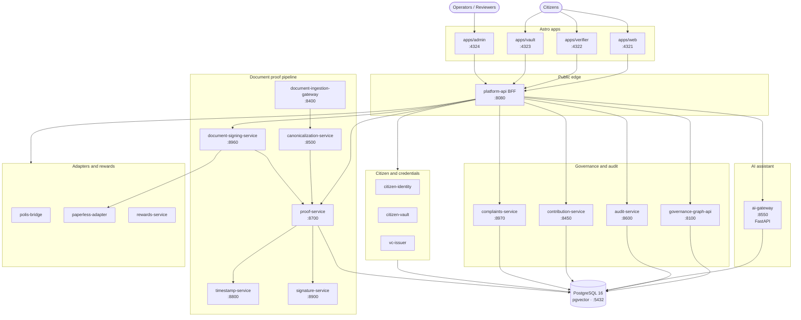

<div align="center">

# Polis Interface

**Say something to your government — a remark, a question, a complaint — then watch the file: who got it, what they promised, what changed.**

A complaint, a promise, and a document all sit on the same public record. Every claim shows its source. Every promise is checked by reviewers against evidence, not by the person who made it. Every registered document can be verified by anyone holding a copy.

[](https://github.com/basicalex/polis/actions/workflows/ci.yml)
[](NOTICE)
[](#honest-status)

<sub>[What you can do](#what-you-can-do-here) · [Demo walk](#see-it-work) · [Quickstart](#quickstart) · [Architecture](#architecture) · [Docs](#documentation)</sub>

</div>

---

## What is this?

Someone reports a broken thing. It goes into an office, and nothing comes back out. The documents that would explain the decision circulate with no proof of where they came from; promises drift from records; dashboards summarise without sources.

Polis Interface works both directions:

- **For the community** — a way to raise issues, file complaints, write down how a rule actually works and show the document that says so, and then *see* what happens: who is responsible, what they committed to, and how far along it is.
- **For institutions and campaigns** — a way to publish a programme and have each promise scored in public against documents, not in a press release.

Both run on the same data, so it cuts both ways: the public can check the government, and the government can point to proof.

**Status: this is a local v1 prototype.** It runs on your machine against synthetic data and mock providers. It is not deployed anywhere and holds no real resident or government data. Details in [Honest status](#honest-status).

> **Naming note:** this project is not [pol.is](https://pol.is) (the Computational Democracy Project's deliberation tool) and is not affiliated with it. The repo contains a stub bridge (`polis-bridge-service`) intended to integrate with deliberation tools like it later.

---

## What you can do here

**As a resident (public site, `:4321`)**
- Browse a map of who governs what — institutions, roles, laws, processes — with a source behind every entry.
- Click any claim (e.g. *"the Complaints Office requires identity evidence before accepting a complaint"*) and see the documents it came from, its confidence rating, and its review history.
- File a complaint and follow the case: who it was assigned to, what was requested, what was decided, and the appeal, which goes to a different officer than the one who decided.
- Look up an elected office-holder, read what they committed to, and see the current status of each commitment — set by reviewers in a public queue, not by the office-holder.
- Ask the built-in assistant questions about local government. It answers only from approved public documents and cites them.

**As anyone holding a document (verifier, `:4322/verify`)**
- Drop a file or paste its SHA-256 hash and check whether it is the exact document that was registered — who issued it, when it was timestamped, whether it was since withdrawn or replaced. Files are hashed in your browser and never uploaded.

**As staff (admin, `:4324`)**
- Work the review queue: approve or reject proposed claims and evidence.
- Review what the assistant answered and why, decision by decision.
- Handle private complaint cases with a restricted, tamper-evident audit trail.

---

## See it work

The seed data models a fictional Croatian municipality, **Grad Primjer**, whose complaint procedure has a flaw copied from real procedures: it makes residents prove identity and residence twice, to two different offices. Polis doesn't impose that burden — it documents it, traces it to sources, and tracks the elected official's promise to remove it. A four-step tour after [Quickstart](#quickstart):

1. **Open the governance map** — `localhost:4321/governance/jur-croatia-local`. See the complaint process and the two offices (Public Complaints Office, Municipal Registry Office) that each demand the same documents.
2. **Follow a claim to its sources** — click *"The Public Complaints Office requires identity evidence before accepting and routing a citizen complaint."* You get its confidence badge, review state, the government sources it cites, and its audit trail.
3. **Check on the person responsible** — open `localhost:4321/mandate-holders`. Council member **Ana Demo** committed to ending the duplicate submission by a set date. Her commitment's status comes from reviewed evidence, not her own say-so.
4. **Verify the paper** — her commitment rests on a signed charter document. Take it to `localhost:4322/verify` and confirm the file matches what was registered: hash, signature, timestamp, and whether it was ever revoked or superseded.

---

## Quickstart

Prerequisites: **Bun 1.3.14**, **Node 24**, **Python 3.12** (only for the AI gateway), **PostgreSQL 16** with pgvector on `:5432` (or Docker for the backend stack).

### Fastest sanity check (no database needed)

```bash
bun install --frozen-lockfile
bun run v1:smoke     # self-builds and exercises the core flow against fixtures
```

### Full local demo (recommended)

Needs Postgres 16 on `localhost:5432`.

```bash
bun install --frozen-lockfile
cp .env.example .env
bun run build
bun run db:seed
```

Then in separate shells:

```bash
bun run dev:services                        # all 17 Node services
PORT=8550 uv run python -m polis_aigateway  # Python AI gateway (optional, for the assistant)
bun run dev:web                             # public site on :4321
bun run dev:verifier                        # document verifier on :4322
```

Open **http://localhost:4321** and follow the [tour above](#see-it-work).

### Docker Compose (backend stack only)

```bash
bun install --frozen-lockfile
docker compose -f infra/compose/docker-compose.yml up -d --build --wait
docker compose -f infra/compose/docker-compose.yml run --rm seed
```

This starts Postgres and all 18 backend services (17 Node plus the Python AI gateway) on an internal network, with the public API on `:8080`, then seeds the Grad Primjer demo data (the seed job is idempotent — safe to re-run). The UIs still run with `bun run dev:web` / `dev:verifier` as above. Postgres is not published to the host — for direct service access (and the `scripts/phase*-acceptance.mjs` scripts, which expect service ports on localhost) add `--profile debug`.

### Checks

```bash
bun run verify    # build + typecheck + test + v1:smoke
bun run lint
```

---

## Why you can trust what you see

Four rules, all of the time:

- **Every governance fact links to its source.** Institutions, roles, laws, and claims trace back to the document they came from. Nothing stands on its own word.
- **Sensitive actions leave a tamper-evident trail.** Some actions write to a hash-linked log, where each entry seals the one before it, so edits and deletions show. The list of which actions are logged is public — the system never implies it is everything.
- **Important documents are verifiable by anyone.** We freeze the document byte-for-byte and record its fingerprint (SHA-256), signature, and timestamp. Documents can later be withdrawn or replaced, and the record shows which.
- **The AI assistant can be audited.** It answers only from an approved set of public sources, cites them, screens ingested text for prompt injection, and stores every answer's trace for staff review. Review decisions are added, never overwritten.

---

## Honest status

This is a **local v1 prototype**, not a production deployment.

`.env.example` sets `MOCK_EXTERNALS=true` and the stack runs entirely against mock providers. The following are **not** live integrations here:

- Paperless-ngx (upstream document intake)
- Upstream Polis deliberation
- Keycloak / OIDC identity
- External AI providers (a swap-in point exists via `AI_MODE`; the deterministic stub is the default)
- Payment rails
- Production timestamp and signature authorities
- Any government systems

The full dev stack runs one private complaint from filing to appeal, using fake identities and mock providers. The isolated pilot profile — a cut-down deployment that serves public reads only — does not run identity, complaints, AI, signing, or private-document services. No profile is approved for real resident data or government operations.

A project about verifiability has to be honest about what it verifies. Local v1 runs the main flows end to end on fake data; the remaining work is in [ROADMAP.md](ROADMAP.md).

---

## Architecture

Four Astro apps talk to one public API (`platform-api`, the only public edge), which fans out to backend services for the governance graph, document proofs, audit log, AI assistant, contributions, and complaints — all over PostgreSQL.

<details>
<summary><b>Full service diagram</b></summary>



</details>

## Apps

| App | Port | Purpose |
| --- | --- | --- |
| `apps/web` | 4321 | Public site: governance map, claims, commitments, complaints, assistant |
| `apps/verifier` | 4322 | Verify a document against the proof registry (start at `/verify`) |
| `apps/vault` | 4323 | Citizen document vault (dev magic-link login; early shell) |
| `apps/admin` | 4324 | Staff review queue, assistant oversight, private complaint handling |

## Services

`platform-api` is the only public edge — a BFF (backend-for-frontend) in front of everything else. All Node services expose the shared runtime contract from `@polis/service-runtime` — `/healthz`, `/readyz`, `/metrics`, `/version` — and `ai-gateway` exposes equivalent FastAPI routes.

<details>
<summary><b>Full service and port table</b></summary>

<!-- service-catalog:readme:start -->
| Service | Runtime | Port | Summary | Dev launcher |
| --- | --- | ---: | --- | --- |
| `platform-api` | Node 24 | 8080 | Public BFF for governance, proof, assistant, citizen, signing, contribution, rewards, and complaint routes. | Yes (17) |
| `governance-graph-api` | Node 24 | 8100 | Postgres-backed civic graph and governance read API. | Yes (1) |
| `polis-bridge-service` | Node 24 | 8200 | Local Polis issue and conversation bridge with a provider seam. | Yes (3) |
| `paperless-adapter` | Node 24 | 8300 | Document intake and archive adapter for stub or Paperless backends. | Yes (4) |
| `document-ingestion-gateway` | Node 24 | 8400 | Orchestrates document intake, canonicalization, and proof registration. | Yes (9) |
| `contribution-service` | Node 24 | 8450 | Persists evidence-linked claims and review decisions. | Yes (14) |
| `rewards-service` | Node 24 | 8460 | Runs the local civic rewards prototype. | Yes (13) |
| `canonicalization-service` | Node 24 | 8500 | Creates deterministic SHA-256 document hash bundles. | Yes (5) |
| `ai-gateway` | Python 3.12 | 8550 | FastAPI grounded-RAG assistant with stub and OpenAI-compatible provider modes. | No (external) |
| `audit-service` | Node 24 | 8600 | Stores and reads append-only hash-chained audit events. | Yes (2) |
| `citizen-identity-service` | Node 24 | 8650 | Provides local HMAC-based citizen sessions. | Yes (10) |
| `proof-service` | Node 24 | 8700 | Stores proof manifests and serves verification, status, and issuer reads. | Yes (8) |
| `citizen-vault-service` | Node 24 | 8750 | Provides the citizen document vault service shell. | Yes (11) |
| `timestamp-service` | Node 24 | 8800 | Issues local RFC 3161-style timestamps behind a provider seam. | Yes (6) |
| `signature-service` | Node 24 | 8900 | Issues test-key proof signatures and exposes the issuer registry. | Yes (7) |
| `vc-issuer-service` | Node 24 | 8950 | Provides the verifiable credential issuer service shell. | Yes (12) |
| `document-signing-service` | Node 24 | 8960 | Renders charter PDFs and coordinates signing, storage, proof registration, and acceptance. | Yes (15) |
| `complaints-service` | Node 24 | 8970 | Manages private resident complaint cases, staff decisions, and appeals. | Yes (16) |
<!-- service-catalog:readme:end -->

The "Dev launcher" number is the service's start order in `bun run dev:services`. PostgreSQL 16 with pgvector listens on `:5432` inside the local stack.

</details>

<details>
<summary><b>Monorepo tree</b></summary>

```
polis/
├── apps/                    # Astro 5 + React 19 + Tailwind 4 UIs
│   ├── web/                 # Public site (:4321)
│   ├── verifier/            # Proof verifier (:4322)
│   ├── vault/               # Citizen vault (:4323)
│   └── admin/               # Operator + assistant review (:4324)
├── services/                # Node services + Python ai-gateway
├── packages/
│   ├── domain/              # Shared TypeScript types
│   ├── ui/                  # Shared UI primitives
│   ├── db/                  # Drizzle schema, migrations, seed
│   ├── policy-rules/        # Access rules as code (OPA / Rego)
│   ├── service-runtime/     # /healthz /readyz /metrics /version contract
│   └── py-core/             # Shared Pydantic models
├── infra/
│   └── compose/             # docker-compose.yml for the backend stack
├── scripts/                 # dev-services, phase acceptance, v1 smoke
└── docs/                    # Architecture, operations, methodology
```

</details>

---

## Documentation

**Understand the system**
[Architecture](ARCHITECTURE.md) — every app, package, and service with its port, plus the end-to-end evidence flow · [Service map](docs/architecture/service-map.md) — per-service HTTP routes · [Representative accountability](docs/architecture/representative-accountability.md) — how office-holder commitments are tracked, and the firewall against campaigning use · [Full system spec](polis_interface_full_system_spec.md) · [Roadmap](ROADMAP.md)

**Trust and safety**
[Security](SECURITY.md) · [Privacy](PRIVACY.md) · [AI safety](AI_SAFETY.md) · [Threat model](THREAT_MODEL.md) · [Transparency](TRANSPARENCY.md) · [What verification proves](docs/document-trust/verification.md) · [Evidence rules](docs/public-methodology/evidence-rules.md)

**Project**
[Contributing](CONTRIBUTING.md) · [Governance](GOVERNANCE.md) · [Code of conduct](CODE_OF_CONDUCT.md) · [Design system](DESIGN.md) · [Notice](NOTICE)

---

## License

Code is **AGPL-3.0-or-later**. See [NOTICE](NOTICE) for integration and content obligations tracked by this repository.

<div align="center">
<sub>Polis Interface · built to be checked, not trusted.</sub>
</div>
