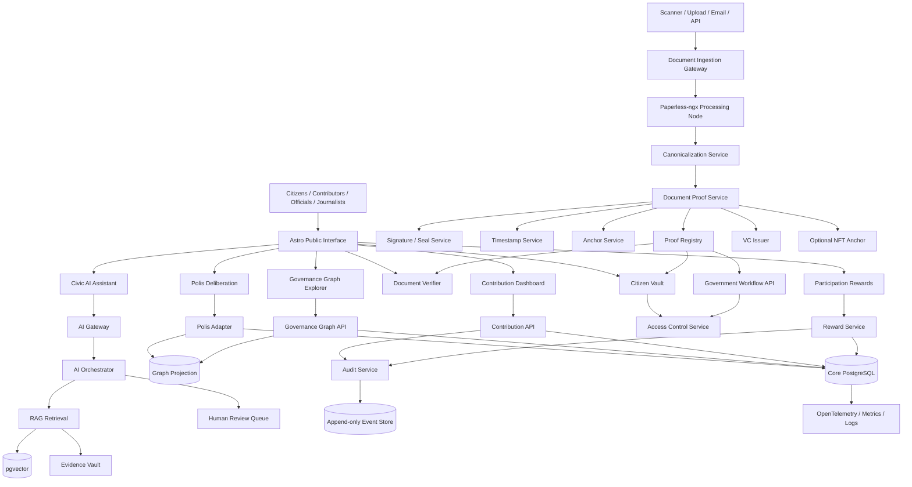
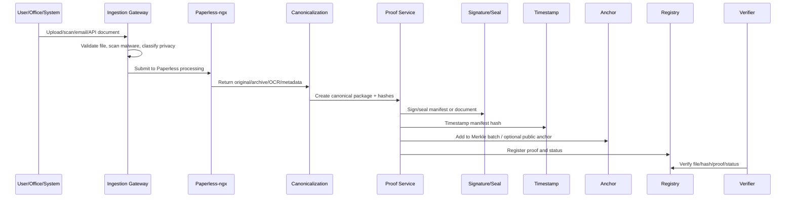
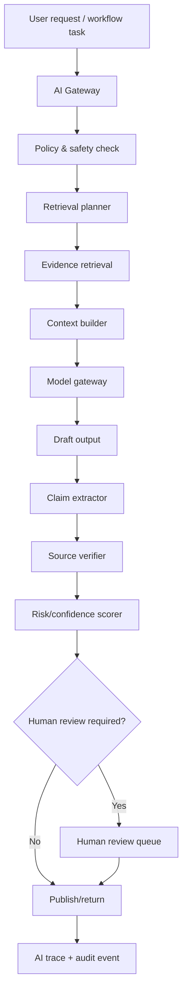
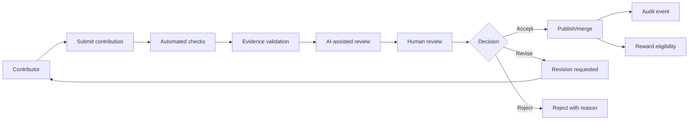
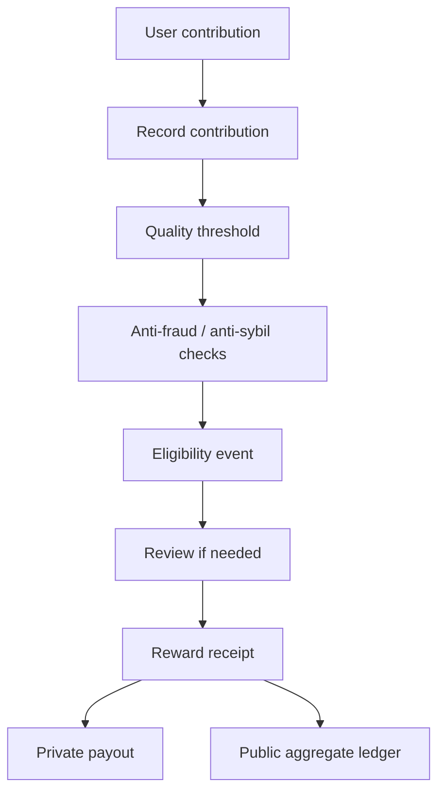

# Polis Interface Full System Specification

**Project domain:** `polis.intrface.eu`  
**Working monorepo name:** `polis-interface`  
**Document version:** 0.1 implementation draft  
**Date:** 2026-06-06  
**Status:** Strategic and technical specification for agent/developer implementation sessions  

---

## Table of contents

- [0. Executive summary](#0-executive-summary)
- [1. Mission, purpose, and strategic frame](#1-mission-purpose-and-strategic-frame)
- [2. Non-negotiable principles](#2-non-negotiable-principles)
- [3. Project scope](#3-project-scope)
- [4. Licensing and openness strategy](#4-licensing-and-openness-strategy)
- [5. Stakeholders and users](#5-stakeholders-and-users)
- [6. Product architecture overview](#6-product-architecture-overview)
- [7. Monorepo structure](#7-monorepo-structure)
- [8. Application layer specification](#8-application-layer-specification)
- [9. Service layer specification](#9-service-layer-specification)
- [10. Data architecture](#10-data-architecture)
- [11. Governance graph ontology](#11-governance-graph-ontology)
- [12. Evidence vault](#12-evidence-vault)
- [13. Polis deliberation layer](#13-polis-deliberation-layer)
- [14. Sovereign civic document layer](#14-sovereign-civic-document-layer)
- [15. Cryptographic document proof architecture](#15-cryptographic-document-proof-architecture)
- [16. Citizen vault and access control](#16-citizen-vault-and-access-control)
- [17. AI assistance architecture](#17-ai-assistance-architecture)
- [18. Assessment engine](#18-assessment-engine)
- [19. Contribution and review architecture](#19-contribution-and-review-architecture)
- [20. Civic reward architecture](#20-civic-reward-architecture)
- [21. Identity and access management](#21-identity-and-access-management)
- [22. Policy-as-code](#22-policy-as-code)
- [23. API specification](#23-api-specification)
- [24. Security architecture](#24-security-architecture)
- [25. Privacy and data protection](#25-privacy-and-data-protection)
- [26. Observability and audit](#26-observability-and-audit)
- [27. Deployment and sovereign hosting](#27-deployment-and-sovereign-hosting)
- [28. Strategic communication architecture](#28-strategic-communication-architecture)
- [29. Transition strategy](#29-transition-strategy)
- [30. Implementation roadmap](#30-implementation-roadmap)
- [31. Agent implementation playbook](#31-agent-implementation-playbook)
- [YYYY-MM-DD - Session title](#yyyy-mm-dd---session-title)
- [32. Risk register](#32-risk-register)
- [33. Public documentation requirements](#33-public-documentation-requirements)
- [34. Initial demo scenario](#34-initial-demo-scenario)
- [35. Recommended first build order](#35-recommended-first-build-order)
- [36. Key architectural decisions](#36-key-architectural-decisions)
- [37. References and standards](#37-references-and-standards)
- [38. Final implementation mandate](#38-final-implementation-mandate)

---

## 0. Executive summary

Polis Interface is an open-source civic infrastructure project for mapping government, opening deliberation, digitizing and verifying official documents, assisting citizens and institutions with AI, and creating a practical transition path from opaque paper-heavy governance toward transparent, participatory, cryptographically verifiable public service.

The project should not begin as an attack on individual politicians, civil servants, offices, or citizens. It should begin as a public intelligence layer that makes existing governance legible, makes public documents verifiable, makes participation scalable, and makes better workflows possible without forcing instant institutional war.

The central product thesis is:

> **The citizen should no longer be the courier, translator, verifier, and error-handler between disconnected government systems. The system should carry the proof. The citizen should carry the authority.**

The central political thesis is:

> **Bad incentive architecture creates predictable corruption, delay, fear, opacity, and personal-gain optimization. The transition begins by mapping the machine, helping everyone inside and outside it, and replacing failure modes with open, audited, assistive, reliable structures.**

The central software thesis is:

> **Open governance needs open code, open proof, open process, open deliberation, and strict privacy for personal documents.**

This specification defines the full end-to-end architecture for the first major implementation line of Polis Interface:

1. **Public civic interface** built with Astro.
2. **Polis deliberation layer** integrated from the Computational Democracy Project.
3. **Governance graph** for institutions, roles, powers, laws, budgets, processes, documents, risks, and controls.
4. **Evidence vault** for source-linked public claims and machine-readable public records.
5. **Sovereign civic document layer** using Paperless-ngx as a document processing node.
6. **Cryptographic proof registry** for hashes, signatures, e-seals, timestamps, provenance, revocation, supersession, and optional blockchain/NFT anchoring.
7. **Citizen vault** for private official documents and controlled sharing.
8. **AI assistance layer** for explanation, mapping, source extraction, summarization, adversarial auditing, and transition planning.
9. **Assessment engine** for efficacy, safety, hardness, reliability, and legitimacy.
10. **Contribution and review system** for community mapping, evidence contribution, methodology improvement, and open-source development.
11. **Civic reward system** for verified useful participation without buying political agreement.
12. **Security, privacy, audit, policy-as-code, observability, and sovereign deployment architecture.**
13. **Transition strategy** from public map to pilots to institutional adoption.

This document is intentionally detailed. It is meant to be handed to coding agents, developers, maintainers, governance contributors, and future government or civil-society partners.

---

## 1. Mission, purpose, and strategic frame

### 1.1 Mission

Polis Interface exists to make governance legible, participatory, verifiable, assistive, and resistant to capture.

It does this by:

- mapping public institutions, roles, laws, budgets, document flows, decision rights, and failure modes;
- opening structured public deliberation around concrete reforms;
- turning official documents into digitally verifiable records;
- letting citizens and institutions share verified proofs instead of dragging paper between offices;
- assisting citizens, civil servants, journalists, experts, and reformers with transparent AI tools;
- creating public transition protocols that move from mapping to pilots to institutional adoption.

### 1.2 The strategic posture

The platform must not begin with shame and blame. That would create enemies immediately and give the current system an easy defensive narrative.

The public posture should be:

> **We are not here to persecute people for adapting to a broken incentive system. We are here to make the system legible, assist everyone, reduce friction, protect citizens, and make accountable public service easier than capture.**

This stance is not naive. It does not mean there is no accountability. It means the platform attacks the failure mode before attacking the person.

Use this principle everywhere:

> **Map powers, incentives, risks, and controls first. Name individuals only where legally public, evidence-backed, relevant, and necessary.**

### 1.3 The transition logic

The project should not ask society to jump off a cliff from one system into another. It should build a bridge.

The transition formula is:

```text
Map -> Explain -> Assist -> Verify -> Deliberate -> Propose -> Stress-test -> Pilot -> Institutionalize -> Transfer
```

Never:

```text
Design -> Declare -> Replace
```

The system earns legitimacy by becoming useful before becoming powerful.

### 1.4 The core public promise

A citizen should be able to ask:

- Which office is responsible?
- Which law gives it that power?
- Which document do I need?
- Why do I need it?
- Is this document valid?
- Who issued it?
- Can another office verify it without me carrying it?
- Where does delay happen?
- Where can corruption enter?
- What reform would remove this failure mode?
- What does the public broadly agree on?
- What did AI assist with, and what did humans decide?

Polis Interface should answer these questions openly, with evidence.

---

## 2. Non-negotiable principles

### 2.1 Open source, public code, and public process

All project-owned software should be open-source, preferably AGPL-3.0-or-later where legally possible. The public deployment must display source-code links and build/version metadata.

However, open source alone is not enough. The project must also publish:

- methodology;
- scoring rules;
- policies;
- data schemas;
- risk models;
- AI prompt templates where safe;
- AI evaluation suites;
- audit procedures;
- governance decisions;
- partner agreements;
- transition protocols.

This is public code in the deeper sense: software plus policy plus process.

### 2.2 AI assists; AI does not rule

AI may explain, retrieve, summarize, classify, extract, draft, compare, simulate, and audit. AI must not secretly make binding governance decisions.

Required rule:

> **Any AI output that affects public knowledge, scoring, document classification, reward eligibility, or transition decisions must have source traceability, model metadata, review state, and a challenge path.**

### 2.3 Open proofs, private people

The platform should open public records and public proofs. It should not expose private citizen documents.

Required rule:

> **Open the governance machine, not the private life of the citizen.**

### 2.4 Proof is not truth

Cryptography can prove integrity, provenance, signature, timestamp, and registry status. It cannot prove that a claim is morally, politically, or legally true by itself.

Required rule:

> **Document verification says what can be cryptographically and institutionally verified. It must not overclaim legal validity without issuer authority, certificate status, revocation status, jurisdiction, and relying-party policy.**

### 2.5 Reward participation, not political agreement

The civic reward system must never buy votes, agreement, consensus, or political outcomes.

Reward only:

- meaningful participation;
- evidence contribution;
- review;
- translation;
- accessibility work;
- issue mapping;
- bug reports;
- civic education tasks;
- document validation tasks;
- moderation support;
- public-code contributions.

### 2.6 No secret governance

Every rule that affects public claims, contribution status, role mappings, rewards, moderation, document proof status, or AI boundaries must be versioned and inspectable unless there is a narrow privacy/security exception.

### 2.7 No personal persecution layer

The platform is not an enemy-list generator. It maps roles, powers, legal mandates, budgets, processes, documents, and failure modes.

### 2.8 No fake neutrality

The project is not neutral between transparency and secrecy, dignity and humiliation, accountability and capture, or participation and exclusion.

It is openly:

- pro-transparency;
- pro-human rights;
- pro-accountability;
- pro-participation;
- pro-open-source;
- pro-privacy;
- anti-capture;
- anti-corruption;
- anti-shadow-governance.

### 2.9 Continuity matters

Government touches healthcare, courts, pensions, permits, education, taxes, social services, emergency response, public safety, and infrastructure. Transition must be gradual, reversible, measurable, and continuity-preserving.

### 2.10 Useful first, powerful later

The first credible product is not a new constitution. It is useful infrastructure:

- a public map;
- a document verifier;
- a citizen assistant;
- a Polis deliberation page;
- a paper-heavy process turned into an evidence-linked reform proposal;
- a pilot with measurable reduction in friction.

---

## 3. Project scope

### 3.1 In scope

Polis Interface includes the following product areas.

#### Public civic interface

A public-facing website and application at `polis.intrface.eu`, built with Astro, that exposes maps, issue pages, proposals, deliberations, verifier tools, contribution flows, and public documentation.

#### Polis deliberation integration

Integration with the Computational Democracy Project's Polis software for large-scale public input, clustering, consensus discovery, and disagreement mapping.

#### Governance graph

A machine-readable model of governance:

```text
Institutions -> Roles -> Mandates -> Laws -> Budgets -> Processes -> Documents -> Decisions -> Effects -> Risks -> Controls
```

#### Evidence vault

A public evidence layer linking claims to sources, hashes, documents, confidence levels, reviewers, and audit history.

#### Sovereign civic document layer

Document ingestion, OCR, classification, search, archival processing, metadata extraction, and workflow routing using Paperless-ngx as a document processing node.

#### Cryptographic proof registry

A system for generating and verifying:

- document hashes;
- canonical manifests;
- digital signatures;
- institutional e-seals;
- RFC 3161/eIDAS timestamps;
- C2PA-style provenance;
- Merkle batch anchors;
- revocation/supersession records;
- verifiable credentials;
- optional NFT/blockchain anchors for public records.

#### Citizen vault

Private citizen-controlled official document vault with access grants, verification, sharing, revocation, and future EUDI Wallet bridge.

#### AI assistance layer

Assistants for citizens, contributors, civil servants, journalists, experts, and maintainers.

#### Assessment engine

Scoring of institutions, processes, roles, proposals, and document workflows across:

- efficacy;
- safety;
- hardness;
- reliability;
- legitimacy.

#### Contribution and review system

Community contribution pipelines with structured review, evidence validation, issue tracking, source-linked edits, reputation controls, and audit logs.

#### Civic reward system

A privacy-preserving reward system for useful verified participation, funded by grants, donations, or government partnerships without buying agreement.

#### Transition engine

Workflow for turning public maps and deliberation outputs into reform proposals, pilot charters, evaluation plans, sunset clauses, and institutional adoption pathways.

### 3.2 Out of scope for early versions

The following are explicitly out of scope for v0/v1:

- binding public lawmaking authority;
- electoral campaigning as a party tool;
- personal corruption accusation databases;
- publication of private citizen documents;
- classified/security-sensitive government records;
- fully automated public decision-making;
- blockchain-first document validity;
- reward based on political opinion;
- unrestricted scraping of sensitive personal data;
- live integration with production tax/court/health systems before legal partnership and security review.

### 3.3 Later-scope possibilities

Potential later expansion:

- federated deployments by municipalities, NGOs, universities, public agencies;
- OOTS-compatible evidence exchange;
- EUDI Wallet credential issuing and verifying;
- official government document issuance pilots;
- participatory budgeting workflows;
- procurement transparency pilots;
- public appointment assessment support;
- public service workflow simplification;
- constitutional transition modeling;
- civic education academy;
- global governance ontology standard.

---

## 4. Licensing and openness strategy

### 4.1 Upstream license reality

The architecture uses two important upstream projects:

- Polis from the Computational Democracy Project: AGPL-3.0.
- Paperless-ngx: GPL-3.0.

Do not say that Paperless-ngx is AGPL. It is GPL-3.0. The correct strategy is to keep Paperless-ngx upstream-aligned, run it as a document-processing service, and license project-owned network-facing platform code as AGPL-3.0-or-later where possible.

### 4.2 Recommended license matrix

| Asset or component | Recommended license | Notes |
|---|---|---|
| Polis-derived code | AGPL-3.0, matching upstream | Keep source available to network users. |
| Paperless-ngx upstream code | GPL-3.0, matching upstream | Do not relicense upstream code. |
| Paperless-ngx modifications | GPL-3.0-compatible | Prefer upstream contributions. |
| New Polis Interface platform code | AGPL-3.0-or-later | Network copyleft matches mission. |
| Public specs and methods | CC BY 4.0 or CC BY-SA 4.0 | Reusable public knowledge. |
| Public datasets | CC0, CC BY, ODC-BY, or source-compatible | Depends on source/legal basis. |
| AI prompts and evals | AGPL for code-like assets; CC BY for docs | Keep transparent where safe. |
| Brand/name/logo | Separate trademark policy | Prevent deceptive forks without blocking code reuse. |
| Sensitive data | Not open by default | Publish only lawful public records or anonymized aggregates. |

### 4.3 Repository obligations

Every repository should include:

```text
LICENSE
NOTICE
README.md
CONTRIBUTING.md
CODE_OF_CONDUCT.md
SECURITY.md
GOVERNANCE.md
ROADMAP.md
ARCHITECTURE.md
PRIVACY.md
AI_SAFETY.md
THREAT_MODEL.md
TRANSPARENCY.md
```

### 4.4 Source visibility in product

Every public deployment should show:

- source repository URL;
- deployed commit SHA;
- license summary;
- build timestamp;
- service version;
- known limitations;
- public issue tracker link;
- security disclosure link.

### 4.5 Public-code governance

The project should align with the Standard for Public Code spirit:

- policy and source are developed together;
- public purpose is explicit;
- documentation is usable;
- code is reusable;
- governance is accountable;
- contributors can understand how decisions are made.

---

## 5. Stakeholders and users

### 5.1 Primary user groups

#### Citizens

Citizens need understandable governance, digital proof, document verification, process guidance, and a safe way to participate.

#### Contributors

Contributors map institutions, submit evidence, review claims, translate content, improve software, design proposals, test AI, and audit methods.

#### Civil servants

Civil servants need tools that reduce workload, clarify responsibility, simplify document flows, and let them improve systems without being punished for honesty.

#### Reform-minded officials

Officials need public legitimacy, evidence-backed proposals, low-risk pilots, and mechanisms for visible improvement.

#### Journalists and watchdogs

Journalists need source-linked maps, document proof, public audit logs, and explainable institutional flows.

#### NGOs and universities

These groups need research-grade data, reproducible methods, public deliberation outputs, and pilot partnerships.

#### Government partners

Partners need secure deployment, legal compatibility, public accountability, integration APIs, and measurable public value.

### 5.2 Adversarial actors

Assume the system will be attacked by:

- spam networks;
- propaganda groups;
- reward farmers;
- hostile insiders;
- parties trying to capture narratives;
- vendors trying to privatize extensions;
- attackers seeking private documents;
- ideological factions trying to dominate maps;
- officials trying to suppress uncomfortable results;
- fake contributors inserting false evidence;
- AI prompt-injection attempts via documents.

The architecture must be designed for hardness from the beginning.

---

## 6. Product architecture overview

### 6.1 Full platform map



### 6.2 Separation of powers inside the software

The system should avoid a single monolith that privately controls mapping, AI, document proof, deliberation, identity, rewards, and moderation.

Each layer should have bounded responsibility:

| Layer | Responsibility | Capture resistance |
|---|---|---|
| Public interface | Readability, navigation, education | Static-first, public, cacheable, source-linked. |
| Deliberation | Public input and consensus mapping | Polis upstream alignment, transparent reports. |
| Governance graph | Institutional truth model | Evidence-linked claims, review states, versioning. |
| Evidence vault | Source and document traceability | Hashes, citations, source confidence. |
| Document layer | OCR, storage, classification | Restricted zone, encryption wrapper, proof separation. |
| Proof layer | Cryptographic validity and registry status | Open schemas, public verifier, append-only logs. |
| AI layer | Assistance and analysis | Human review, logs, evals, no hidden authority. |
| Assessment layer | Risk and quality scoring | Public methodology, dissenting reviews. |
| Reward layer | Participation stipend | Reward effort, not agreement; anti-fraud. |
| Audit layer | Accountability | Append-only, public where possible. |
| Transition layer | Pilots and adoption | Sunset clauses, measured outcomes. |

### 6.3 Recommended technology stack

| Area | Recommendation | Rationale |
|---|---|---|
| Public site | Astro + TypeScript | Static-first public knowledge with dynamic islands. |
| Interactive UI | React islands initially | Strong ecosystem for assistant, graph, dashboard components. |
| Styling | Tailwind or vanilla CSS tokens | Fast, consistent, easy to maintain. |
| Backend API | TypeScript BFF + Python services | TS for web/platform, Python for AI/data/document tasks. |
| Python API | FastAPI | Typed APIs, OpenAPI, production-ready. |
| Agent orchestration | LangGraph | Durable workflows and human-in-loop paths. |
| Primary DB | PostgreSQL | Reliable relational source of truth. |
| Vector search | pgvector | Start inside Postgres before adding specialized vector DB. |
| Graph | Postgres adjacency first; graph projection later | Avoid premature graph DB complexity. |
| Graph DB later | Neo4j, Memgraph, or RDF store | Heavy graph traversal and public explorer needs. |
| Eventing | NATS + JetStream | Lightweight event bus with persistence. |
| Identity | Keycloak/OIDC + passkeys | Self-hostable identity, government-compatible protocols. |
| Policy | Open Policy Agent / Rego | Versioned policy-as-code. |
| Documents | Paperless-ngx | OCR/search/archive processing node. |
| Object storage | S3-compatible storage / MinIO | Sovereign/self-hosted friendly. |
| Observability | OpenTelemetry + Prometheus + Grafana/Loki | Vendor-neutral telemetry and dashboards. |
| Containers | Docker Compose first, Kubernetes later | Reduce early complexity; scale when needed. |
| Supply chain | Sigstore/Cosign + SLSA targets | Signed builds and provenance. |
| Security testing | OWASP ASVS baseline | Concrete web/API security requirements. |

---

## 7. Monorepo structure

### 7.1 Root layout

```text
polis-interface/
├── apps/
│   ├── web/                         # Astro public portal
│   ├── admin/                       # Admin/reviewer dashboard
│   ├── verifier/                    # Public document verifier UI
│   ├── vault/                       # Citizen vault UI
│   ├── storybook/                   # Component/system documentation
│   └── docs/                        # Optional docs-only site if split from web
│
├── services/
│   ├── platform-api/                # Main BFF/API for web apps
│   ├── governance-graph-api/        # Institutions, roles, laws, processes, graph queries
│   ├── polis-adapter/               # Sync Polis conversations/reports into platform
│   ├── ai-orchestrator/             # FastAPI + LangGraph workflows
│   ├── ingestion-workers/           # Public data/doc ingestion jobs
│   ├── assessment-engine/           # Scoring, failure-mode assessment, simulation
│   ├── reward-service/              # Civic reward rules, eligibility, ledger
│   ├── audit-service/               # Append-only audit events
│   ├── notification-service/        # Email/webhooks/activity updates
│   │
│   ├── document-ingestion-gateway/  # Upload/scan/email/API intake
│   ├── paperless-adapter/           # Safe wrapper over Paperless-ngx API
│   ├── canonicalization-service/    # PDF/A, metadata normalization, package hashes
│   ├── document-proof-service/      # Proof manifests, hash manifests, registry records
│   ├── signature-service/           # eIDAS/QES/AdES/eSeal/DSS integration
│   ├── timestamp-service/           # RFC3161/eIDAS timestamp integration
│   ├── anchor-service/              # Merkle logs, public ledger, chain anchors
│   ├── vc-issuer-service/           # Verifiable credential issuance and status
│   ├── nft-anchor-service/          # Optional public-record NFT anchoring only
│   ├── verifier-api/                # Public/private verification endpoints
│   ├── access-control-service/      # Grants, sharing, privacy policies
│   ├── redaction-service/           # Redaction and public/private derivative workflows
│   ├── retention-policy-service/    # Retention, archival, erasure, legal hold
│   └── oots-connector/              # EU Once-Only style evidence exchange later
│
├── packages/
│   ├── ui/                          # Shared UI components
│   ├── config/                      # Shared eslint/prettier/tsconfig settings
│   ├── db/                          # Schema, migrations, query helpers
│   ├── graph-schema/                # Governance ontology types and validators
│   ├── document-proof-schema/       # Proof manifest schemas
│   ├── crypto-utils/                # Hashing, signing helpers, Merkle utilities
│   ├── vc-schemas/                  # Verifiable credential schemas
│   ├── policy-rules/                # OPA/Rego policies
│   ├── ai-prompts/                  # Versioned prompt templates
│   ├── ai-evals/                    # Evaluation suites and test cases
│   ├── civic-methods/               # Scoring methodology and failure-mode library
│   ├── sdk/                         # Public TypeScript SDK
│   ├── api-client/                  # Generated OpenAPI clients
│   ├── observability/               # OTEL setup, logging conventions
│   ├── test-utils/                  # Shared test helpers
│   └── fixtures/                    # Shared seed fixtures
│
├── infra/
│   ├── docker/                      # Dockerfiles
│   ├── compose/                     # Local/dev/staging Docker Compose
│   ├── k8s/                         # Kubernetes manifests later
│   ├── terraform/                   # Infrastructure provisioning
│   ├── ansible/                     # Sovereign host provisioning
│   ├── caddy/                       # Reverse proxy config
│   ├── keycloak/                    # Realm exports and identity config
│   ├── postgres/                    # Init scripts and backup tooling
│   ├── nats/                        # JetStream config
│   ├── grafana/                     # Dashboards
│   ├── prometheus/                  # Metrics config
│   ├── otel/                        # Collector config
│   ├── backup/                      # Backup/restore scripts
│   └── sovereign-hosting/           # Production deployment docs
│
├── data/
│   ├── seed/                        # Initial seed data
│   ├── demo/                        # Demo governance maps and document proofs
│   ├── ontologies/                  # Governance ontology source files
│   ├── failure-modes/               # Failure-mode taxonomy data
│   ├── references/                  # External standard refs metadata
│   └── fixtures/                    # Test data
│
├── docs/
│   ├── architecture/
│   ├── product/
│   ├── governance/
│   ├── legal/
│   ├── licensing/
│   ├── privacy/
│   ├── security/
│   ├── ai-safety/
│   ├── document-trust/
│   ├── deployment/
│   ├── contributor-guides/
│   ├── public-methodology/
│   ├── transition/
│   └── agent-playbooks/
│
├── rfcs/                            # Architecture/governance RFCs
├── adr/                             # Architecture Decision Records
├── scripts/                         # Repo scripts
├── tests/                           # Cross-service integration/e2e tests
├── .github/
│   ├── workflows/
│   ├── ISSUE_TEMPLATE/
│   ├── PULL_REQUEST_TEMPLATE.md
│   └── CODEOWNERS
│
├── package.json
├── pnpm-workspace.yaml
├── turbo.json                       # Optional build orchestration
├── pyproject.toml                   # Python tooling baseline if using uv/ruff globally
├── LICENSE
├── NOTICE
├── README.md
├── CONTRIBUTING.md
├── CODE_OF_CONDUCT.md
├── SECURITY.md
├── GOVERNANCE.md
├── ROADMAP.md
├── ARCHITECTURE.md
├── PRIVACY.md
├── AI_SAFETY.md
├── THREAT_MODEL.md
└── TRANSPARENCY.md
```

### 7.2 Monorepo conventions

#### Languages

- TypeScript strict mode for web, APIs, SDKs, schemas.
- Python 3.12+ for AI, ingestion, assessment, document transformation.
- SQL migrations committed and reviewed.
- Rego for policy-as-code.
- Markdown/MDX for public documentation.

#### Package managers

- `pnpm` for TypeScript workspaces.
- `uv` or Poetry for Python services. Prefer `uv` for speed if the team is comfortable.
- Docker for service isolation.

#### Naming conventions

- Services: kebab-case, e.g. `document-proof-service`.
- Packages: kebab-case, e.g. `graph-schema`.
- TypeScript modules: camelCase exports, PascalCase types.
- Database tables: snake_case plural, e.g. `document_proof_manifests`.
- Event topics: dot.case, e.g. `document.proof.created`.

#### API conventions

- REST/JSON first.
- OpenAPI specs generated for every service.
- Stable public APIs versioned under `/api/v1`.
- Internal APIs prefixed under `/internal` and network-restricted.
- All mutating operations produce audit events.
- All services expose `/healthz`, `/readyz`, `/metrics`, and `/version`.

#### Testing conventions

- Unit tests for domain logic.
- Contract tests for service APIs.
- Integration tests for event flows.
- E2E tests for critical citizen workflows.
- Regression fixtures for AI prompts and document proof generation.
- Security tests aligned to OWASP ASVS controls.

#### Pull request rules

Every PR should include:

- linked issue or RFC;
- user-impact summary;
- tests added or updated;
- migration notes if schema changes;
- security/privacy review tag if relevant;
- docs update if behavior changes;
- screenshots for UI changes;
- generated API/client updates if endpoints changed.

---

## 8. Application layer specification

### 8.1 `apps/web` - Astro public portal

Purpose: public civic interface for reading, learning, exploring, deliberating, verifying, and contributing.

Required capabilities:

- static-first public pages;
- dynamic islands for assistant, graph explorer, Polis embeds, verification widgets, user status;
- content collections for methodology, governance pages, issue pages, role pages, proposal pages;
- public source/proof display;
- language/localization-ready routing;
- accessibility-first design;
- no login required for reading public information.

Recommended routes:

```text
/
/about
/mission
/source
/methodology
/transparency
/privacy
/security
/governance
/governance/:jurisdiction
/governance/:jurisdiction/:domain
/governance/:jurisdiction/:domain/institutions/:institutionId
/governance/:jurisdiction/:domain/roles/:roleId
/governance/:jurisdiction/:domain/processes/:processId
/issues
/issues/:issueSlug
/issues/:issueSlug/evidence
/issues/:issueSlug/deliberate
/issues/:issueSlug/proposals
/proposals/:proposalId
/deliberate
/deliberate/:conversationId
/proofs
/proofs/:proofId
/verify
/contribute
/contribute/maps
/contribute/evidence
/contribute/review
/rewards
/partners
/partners/:partnerSlug
/audit
/docs
```

### 8.2 `apps/admin` - reviewer/admin dashboard

Purpose: controlled interface for maintainers, reviewers, moderators, partner admins, security admins, and document workflow admins.

Required modules:

- review queue;
- evidence validation;
- graph edit approval;
- document proof review;
- AI output review;
- reward eligibility review;
- moderation queue;
- audit event browser;
- service health dashboard;
- partner workspace management;
- role/permission management via Keycloak/OIDC groups.

Admin must be boring, traceable, and audited. Every admin action creates an audit event.

### 8.3 `apps/verifier` - public verifier

Purpose: upload or hash-check a document and verify whether it matches a registry record.

Capabilities:

- drag/drop file verification;
- hash-only verification;
- QR code scan;
- proof URL resolution;
- signature/e-seal status display;
- timestamp status display;
- revocation/supersession status;
- public/private visibility explanation;
- human-readable result plus raw JSON proof.

Public verification must not leak private document contents. For private documents, verifier should compute hash client-side where possible and send only hashes or salted commitments.

### 8.4 `apps/vault` - citizen vault

Purpose: private document control and sharing.

Capabilities:

- list private official documents;
- verify status;
- show issuer and document type;
- grant access to an office/accountant/system;
- revoke access;
- view access history;
- sign/approve document requests;
- export/share verifiable credential where available;
- future EUDI Wallet bridge.

Vault is not public by default and requires strong identity/authentication.

### 8.5 `apps/storybook`

Purpose: design-system documentation and component testing.

Components:

- `InstitutionCard`;
- `RoleCard`;
- `ProcessCard`;
- `EvidenceCard`;
- `ClaimCard`;
- `FailureModeCard`;
- `ProposalCard`;
- `AssessmentBadge`;
- `RiskBadge`;
- `ConfidenceBadge`;
- `AuditTrail`;
- `SourcePanel`;
- `ConsensusClusterView`;
- `PolisEmbed`;
- `GraphExplorer`;
- `AIExplanationPanel`;
- `ContributionStepper`;
- `RewardReceipt`;
- `VerifierResult`;
- `ProofManifestView`;
- `AccessGrantPanel`.

---

## 9. Service layer specification

### 9.1 `platform-api`

Role: main API/backend-for-frontend for web apps.

Responsibilities:

- session handling;
- user profile lookup;
- public page data aggregation;
- contribution creation;
- dashboard summaries;
- route-friendly API responses;
- auth middleware;
- rate limiting;
- calls to internal services;
- audit event emission for mutations.

Avoid business logic here when possible. Business logic belongs in domain services.

### 9.2 `governance-graph-api`

Role: source of truth for governance model queries.

Responsibilities:

- institutions;
- roles;
- mandates;
- laws;
- budgets;
- processes;
- process steps;
- document requirements;
- decision rights;
- risks;
- controls;
- failure modes;
- relationships;
- graph traversal;
- confidence and evidence display.

### 9.3 `polis-adapter`

Role: integration bridge between Polis and Polis Interface.

Responsibilities:

- create/link Polis conversations;
- sync conversation metadata;
- sync comments/statements where permitted;
- sync group/cluster reports;
- sync consensus statements;
- attach deliberation outputs to issues/proposals;
- preserve Polis upstream compatibility;
- avoid unnecessary fork divergence.

Implementation path:

1. Embed Polis in issue pages.
2. Pull metadata/report exports into our database.
3. Map outputs to proposal lifecycle.
4. Add identity/reward bridge only after basic deliberation works.

### 9.4 `ai-orchestrator`

Role: AI workflow engine.

Responsibilities:

- model gateway routing;
- RAG retrieval planning;
- source-linked answering;
- claim extraction;
- document explanation;
- governance map drafting;
- proposal auditing;
- deliberation summarization;
- transition simulation;
- human-in-loop interruptions;
- AI trace records;
- evaluation runs.

Use LangGraph-style workflows for durable state and human review.

### 9.5 `ingestion-workers`

Role: ingest public data and documents.

Sources:

- public laws;
- budgets;
- government organizational charts;
- procurement notices;
- meeting minutes;
- parliamentary/council records;
- public datasets;
- PDFs and spreadsheets;
- partner-provided documents.

Workers must produce evidence records and never silently overwrite source data.

### 9.6 `assessment-engine`

Role: score processes, institutions, roles, proposals, and document workflows.

Dimensions:

- efficacy;
- safety;
- hardness;
- reliability;
- legitimacy.

Each score must have:

- numeric score;
- confidence;
- rationale;
- evidence;
- dissenting reviews;
- scoring method version;
- AI assistance trace if AI helped;
- human review state.

### 9.7 `reward-service`

Role: participation reward eligibility and ledger.

Responsibilities:

- define rewardable actions;
- anti-fraud checks;
- rate limits and caps;
- eligibility records;
- review queues;
- public aggregate ledger;
- private payout records;
- funding-pool accounting;
- government/grant integration.

Never reward political agreement.

### 9.8 `audit-service`

Role: append-only event store.

Responsibilities:

- receive audit events from all services;
- validate event schema;
- write to append-only store;
- expose public audit records where appropriate;
- hide private personal details;
- export audit bundles;
- support incident investigation.

### 9.9 `document-ingestion-gateway`

Role: safe entry point for documents.

Inputs:

- browser upload;
- scanner upload;
- email intake;
- API intake;
- partner bulk import;
- watched folder in restricted environment.

Responsibilities:

- malware scanning;
- file type validation;
- size limits;
- metadata stripping where appropriate;
- routing to Paperless;
- initial audit event;
- privacy classification.

### 9.10 `paperless-adapter`

Role: wrapper around Paperless-ngx API.

Responsibilities:

- upload to Paperless;
- retrieve OCR text;
- retrieve archived/canonical file;
- retrieve metadata;
- apply controlled tags/custom fields;
- map Paperless records to platform records;
- enforce network restrictions;
- prevent direct public access to Paperless.

Paperless must be treated as restricted infrastructure because its own documentation warns that documents and text can be stored plainly.

### 9.11 `canonicalization-service`

Role: produce canonical document packages for hashing/proof.

Responsibilities:

- preserve original file hash;
- generate canonical PDF/PDF-A where appropriate;
- normalize metadata package;
- hash OCR text separately;
- create manifest preimage;
- record transformation/provenance events;
- avoid destructive transformations;
- flag uncertain conversions.

### 9.12 `document-proof-service`

Role: create and manage document proof manifests.

Responsibilities:

- generate hash manifests;
- create proof records;
- call signature service;
- call timestamp service;
- call anchor service;
- update registry status;
- manage supersession/revocation;
- expose proof JSON;
- emit proof events.

### 9.13 `signature-service`

Role: digital signature, advanced signature, qualified signature, and e-seal integration.

Responsibilities:

- support local test keys in development;
- integrate EU DSS for validation;
- integrate qualified trust service providers later;
- validate certificate chains;
- validate revocation status;
- distinguish signature levels;
- support institutional e-seals;
- maintain issuer key registry.

### 9.14 `timestamp-service`

Role: trusted timestamping.

Responsibilities:

- RFC 3161 timestamp requests;
- qualified/eIDAS timestamp integration later;
- hash-only timestamping;
- timestamp token validation;
- timestamp record storage;
- clock/source metadata.

### 9.15 `anchor-service`

Role: public tamper-evidence anchor.

Responsibilities:

- Merkle batch generation;
- append-only log;
- public batch pages;
- optional blockchain transaction anchoring;
- optional NFT anchor record generation;
- no private data on-chain;
- anchor verification.

### 9.16 `vc-issuer-service`

Role: issue verifiable credentials for documents, roles, participation receipts, or official attestations.

Responsibilities:

- VC schema validation;
- issuer key management;
- credential issuance;
- credential status/revocation;
- selective-disclosure strategy later;
- wallet bridge preparation.

### 9.17 `nft-anchor-service`

Role: optional anchoring for public records only.

This service must not be core. It should be disabled by default and used only when a public partner explicitly wants public blockchain anchoring.

Allowed:

- public laws;
- public datasets;
- public meeting decisions;
- public procurement notices;
- public transparency records;
- Merkle root anchors.

Disallowed:

- private citizen documents;
- health/social/tax records;
- sensitive court documents;
- predictable hashes without salting;
- transferable tokens representing personal rights.

### 9.18 `verifier-api`

Role: verify document hashes, manifests, signatures, timestamps, revocation status, and anchors.

Responsibilities:

- file verification;
- hash verification;
- manifest verification;
- signature/e-seal validation;
- timestamp validation;
- anchor validation;
- status lookup;
- human-readable result construction.

### 9.19 `access-control-service`

Role: access grants and private sharing.

Responsibilities:

- citizen grants access to office/system/person;
- revoke grant;
- purpose limitation;
- time limitation;
- audit access;
- enforce policy-as-code;
- produce least-privilege access tokens.

### 9.20 `redaction-service`

Role: safely produce public derivatives of sensitive documents.

Responsibilities:

- detect possible personal data;
- propose redactions;
- human review;
- create redacted derivative file;
- link derivative to original via provenance;
- separately hash original and redacted version;
- mark redaction legal basis.

### 9.21 `retention-policy-service`

Role: manage retention, expiry, deletion, legal hold, archival preservation.

Responsibilities:

- retention schedules;
- legal holds;
- delete request workflows;
- proof preservation after content deletion;
- audit records;
- partner-specific policies;
- GDPR alignment.

### 9.22 `oots-connector`

Role: later integration with EU once-only evidence exchange patterns.

Responsibilities later:

- evidence request;
- citizen consent/preview;
- government-to-government document exchange;
- mapping document types to procedures;
- cross-border procedure compatibility.

---

## 10. Data architecture

### 10.1 Storage layers

| Data category | Storage | Notes |
|---|---|---|
| Users, contributions, graph records, proofs | PostgreSQL | Primary source of truth. |
| Vector embeddings | PostgreSQL + pgvector | Good enough for v0/v1 RAG. |
| Document originals/archives | Encrypted object storage | S3-compatible, restricted zone. |
| Paperless internal metadata | Paperless PostgreSQL DB | Treat as internal dependency. |
| Graph projection | Postgres adjacency initially; graph DB later | Start simple. |
| Event bus | NATS JetStream | Durable event delivery. |
| Audit log | PostgreSQL append-only + export bundles | Later WORM/immutable store. |
| Search | Postgres full-text initially; Meilisearch/OpenSearch later | Avoid premature operational burden. |
| Backups | Encrypted offsite backup vault | 3-2-1 policy. |

### 10.2 Core entity groups

#### Governance entities

- `jurisdictions`
- `institutions`
- `roles`
- `mandates`
- `laws`
- `budget_lines`
- `processes`
- `process_steps`
- `decision_rights`
- `public_services`
- `document_types`
- `failure_modes`
- `controls`
- `risks`
- `relationships`

#### Evidence entities

- `sources`
- `documents`
- `claims`
- `evidence_links`
- `source_snapshots`
- `review_records`
- `confidence_scores`

#### Deliberation entities

- `polis_conversations`
- `polis_reports`
- `consensus_clusters`
- `deliberation_statements`
- `minority_reports`

#### Proposal and assessment entities

- `issues`
- `proposals`
- `proposal_versions`
- `assessments`
- `score_dimensions`
- `simulation_runs`
- `transition_protocols`
- `pilot_charters`

#### Document proof entities

- `document_objects`
- `document_proof_manifests`
- `signature_records`
- `timestamp_records`
- `anchor_records`
- `issuer_keys`
- `revocation_records`
- `supersession_records`
- `provenance_events`
- `redaction_records`
- `access_grants`
- `retention_policies`

#### AI entities

- `ai_workflows`
- `ai_traces`
- `ai_model_versions`
- `prompt_templates`
- `retrieval_events`
- `ai_review_items`
- `ai_eval_runs`

#### Contribution and reward entities

- `contributors`
- `contributions`
- `reviews`
- `reputation_events`
- `reward_rules`
- `reward_eligibility_events`
- `reward_receipts`
- `funding_pools`

#### Audit entities

- `audit_events`
- `audit_event_redactions`
- `incident_reports`

### 10.3 Universal fields

Most domain tables should include:

```text
id UUID primary key
created_at timestamptz not null
updated_at timestamptz not null
created_by_user_id nullable
updated_by_user_id nullable
status enum
visibility enum
review_state enum
source_confidence numeric nullable
method_version text nullable
audit_correlation_id uuid nullable
```

### 10.4 Review states

Use consistent review states:

```text
draft
submitted
needs_revision
under_review
approved
contested
deprecated
rejected
archived
```

### 10.5 Visibility states

Use consistent visibility states:

```text
public
private
restricted
redacted
sealed
internal
```

---

## 11. Governance graph ontology

### 11.1 Purpose

The governance graph is the central machine-readable model of the state, public administration, and public-service workflows.

It must answer:

- What institution exists?
- What role exists within it?
- What legal mandate authorizes it?
- What decision rights does it control?
- What documents does it issue or require?
- Which process steps depend on it?
- Where can delay, opacity, or capture enter?
- What controls reduce those risks?
- What proposals change this structure?

### 11.2 Graph relationship vocabulary

Core relationships:

```text
JURISDICTION_HAS_INSTITUTION
INSTITUTION_HAS_ROLE
ROLE_AUTHORIZED_BY_LAW
ROLE_HAS_MANDATE
ROLE_CONTROLS_DECISION_RIGHT
ROLE_PARTICIPATES_IN_PROCESS
PROCESS_HAS_STEP
STEP_REQUIRES_DOCUMENT_TYPE
INSTITUTION_ISSUES_DOCUMENT_TYPE
LAW_AUTHORIZES_DOCUMENT_TYPE
BUDGET_FUNDS_INSTITUTION
BUDGET_FUNDS_PROGRAM
PROCESS_CREATES_FAILURE_MODE
FAILURE_MODE_MITIGATED_BY_CONTROL
PROPOSAL_CHANGES_PROCESS
PROPOSAL_REDUCES_FAILURE_MODE
PROPOSAL_INTRODUCES_RISK
CLAIM_SUPPORTED_BY_SOURCE
DOCUMENT_PROOF_LINKS_TO_DOCUMENT_TYPE
POLIS_CONVERSATION_DELIBERATES_ISSUE
CONSENSUS_CLUSTER_SUPPORTS_PROPOSAL
```

### 11.3 Role page specification

Every public role page should include:

```text
Role name
Institution
Jurisdiction
Plain-language description
Legal mandate
Decision rights
Public services touched
Documents issued
Documents required
Budget influence
Dependencies
Failure modes
Controls and appeals
Required competencies
Public pain points
Related proposals
Related Polis conversations
Related proofs/documents
Evidence list
Confidence level
Audit trail
```

### 11.4 Process page specification

Every public process page should include:

```text
Process name
Citizen/business need
Legal basis
Step-by-step flow
Responsible roles
Documents required
Documents issued
Time/cost burden
Failure modes
Appeals/complaints
Digitalization status
Proof status
Simplification candidates
Related Polis deliberations
Related proposals
```

### 11.5 Evidence and confidence

No graph claim is just “true.” It has status:

```text
unsupported_draft
single_source
multi_source
official_source
official_confirmed
expert_reviewed
contested
outdated
superseded
```

Each relationship should be evidence-linked where possible.

---

## 12. Evidence vault

### 12.1 Purpose

The evidence vault is not only file storage. It is the source-linked claim layer.

It stores:

- source documents;
- source snapshots;
- extracted claims;
- citations;
- confidence;
- reviewer decisions;
- hashes;
- public proof links;
- revision history.

### 12.2 Claim model

```ts
type Claim = {
  id: string;
  text: string;
  claimType:
    | "legal_mandate"
    | "budget_amount"
    | "role_responsibility"
    | "process_step"
    | "document_requirement"
    | "risk_assessment"
    | "proposal_assertion"
    | "public_statement"
    | "other";
  subjectType: string;
  subjectId: string;
  evidence: EvidenceLink[];
  confidence: number;
  reviewState: "draft" | "under_review" | "approved" | "contested" | "deprecated";
  createdBy: string;
  createdAt: string;
  methodVersion?: string;
  aiTraceId?: string;
};
```

### 12.3 Evidence link model

```ts
type EvidenceLink = {
  id: string;
  sourceId: string;
  locator?: {
    page?: number;
    lineStart?: number;
    lineEnd?: number;
    xpath?: string;
    tableCell?: string;
    timestamp?: string;
  };
  quote?: string;
  paraphrase?: string;
  sourceHash?: string;
  retrievedAt?: string;
  confidence: number;
};
```

### 12.4 Evidence rules

- Prefer official primary sources.
- Keep source snapshots where legally allowed.
- For PDFs, store page references.
- For web pages, store retrieval timestamp and hash/snapshot where allowed.
- AI-extracted claims must be reviewed before being accepted as graph truth.
- Claims should degrade if sources become outdated or superseded.

---

## 13. Polis deliberation layer

### 13.1 Purpose

Polis is the public deliberation engine. It should be used to discover where groups agree, where they disagree, and what language different groups use to express their concerns.

Polis is not a binding vote by default. It is a consensus and disagreement mapping tool.

### 13.2 Integration model

Each issue page can have one or more Polis conversations.

```text
Issue page
  -> evidence pack
  -> framing question
  -> Polis conversation
  -> cluster report
  -> consensus statements
  -> minority reports
  -> proposal drafts
  -> assessment
  -> pilot candidate
```

### 13.3 Conversation setup rules

Each Polis conversation should have:

- clear framing question;
- public evidence pack;
- moderation rules;
- participation mode: anonymous/pseudonymous/verified;
- reward eligibility status;
- conversation lifecycle dates;
- statement submission rules;
- result publication plan;
- minority report policy.

### 13.4 Deliberation outputs

Outputs should include:

- consensus statements;
- high-disagreement statements;
- cluster summaries;
- minority concerns;
- participation metadata;
- suspected manipulation notes;
- AI summarization trace if AI helped;
- human-edited final report.

### 13.5 Polis adapter data

```ts
type PolisConversationRecord = {
  id: string;
  externalPolisId: string;
  issueId: string;
  title: string;
  framingQuestion: string;
  participationMode: "open" | "pseudonymous" | "verified" | "partner_restricted";
  status: "draft" | "active" | "closed" | "reported" | "archived";
  reportUrl?: string;
  createdAt: string;
  closedAt?: string;
};
```

---

## 14. Sovereign civic document layer

### 14.1 Purpose

The document layer replaces paper trails with verifiable document flows.

It must support:

- scanning legacy paper;
- ingesting digital files;
- OCR;
- classification;
- metadata extraction;
- archival storage;
- cryptographic proof;
- signatures/e-seals;
- timestamps;
- revocation/supersession;
- citizen-controlled sharing;
- public verification.

### 14.2 Paperless-ngx role

Paperless-ngx should be used as a restricted document-processing node, not as the public trust boundary.

It is good for:

- OCR;
- document ingestion;
- metadata management;
- full-text search;
- tags/document types/correspondents;
- workflows;
- archive versions;
- user permissions inside a restricted environment.

It is not sufficient by itself for:

- public proof registry;
- citizen-controlled cryptographic sharing;
- eIDAS signatures/e-seals;
- timestamp trust;
- privacy-preserving blockchain anchoring;
- public governance graph integration;
- broad civic transition architecture.

### 14.3 Document pipeline



### 14.4 Document classes

```text
public-government-record
citizen-private-document
restricted-administrative-record
open-data-publication
court-or-legal-record
tax-or-accounting-record
internal-draft
redacted-public-derivative
```

### 14.5 Content visibility

```text
public
private
restricted
redacted
sealed
```

### 14.6 Proof visibility

```text
public
restricted
private
commitment_only
```

### 14.7 Public vs private rule

Public laws, budgets, meeting decisions, procurement notices, public datasets, public service process definitions, and public proof pages should be open where legally allowed.

Citizen tax, health, disability, social, family, court-sensitive, or private business records must remain private unless explicitly and lawfully shared.

### 14.8 Citizen document flow

Old flow:

```text
Office A prints document.
Citizen carries document.
Office B scans document.
Office C asks for original.
Accountant emails a copy.
Tax office requests another copy.
Citizen repeats the loop.
```

New flow:

```text
Office A issues signed/sealed document.
Proof is registered.
Citizen receives vault item or credential.
Office B requests access/proof.
Citizen approves.
Office B verifies directly.
Audit records the exchange.
```

---

## 15. Cryptographic document proof architecture

### 15.1 Core principle

NFTs are optional. The root of trust is not an NFT. The root of trust is:

```text
canonical document package + cryptographic hash + issuer signature/seal + trusted timestamp + registry status + revocation/supersession + audit trail
```

### 15.2 Document Proof Manifest

```ts
type DocumentProofManifest = {
  id: string;
  version: "1.0";
  documentClass:
    | "public-government-record"
    | "citizen-private-document"
    | "restricted-administrative-record"
    | "open-data-publication"
    | "court-or-legal-record"
    | "tax-or-accounting-record"
    | "internal-draft"
    | "redacted-public-derivative";

  issuer: {
    id: string;
    name: string;
    jurisdiction?: string;
    institutionId?: string;
    roleId?: string;
    publicKeyRef: string;
    certificateRef?: string;
  };

  subject?: {
    type: "person" | "organization" | "asset" | "case" | "process" | "public_record";
    privacyMode: "public" | "pseudonymous" | "encrypted" | "redacted" | "commitment_only";
    identifierCommitment?: string;
  };

  documentType: {
    id: string;
    name: string;
    legalBasisRefs?: string[];
    governanceGraphRefs?: string[];
  };

  hashes: {
    algorithm: "sha256" | "sha512" | "blake3";
    originalFileHash: string;
    canonicalPdfHash?: string;
    ocrTextHash?: string;
    metadataHash?: string;
    manifestHash: string;
    saltedCommitment?: string;
  };

  signatures: Array<{
    id: string;
    type: "citizen-signature" | "official-signature" | "institutional-seal";
    standard?: "eIDAS-QES" | "eIDAS-AdES" | "eIDAS-eSeal" | "test-key" | "other";
    signerRef: string;
    certificateRef?: string;
    signatureValueRef: string;
    signedHash: string;
    signedAt?: string;
    validationStatus?: "valid" | "invalid" | "indeterminate" | "not_checked";
  }>;

  timestamps: Array<{
    id: string;
    type: "RFC3161" | "eIDAS-qualified-timestamp" | "blockchain-anchor" | "internal-test";
    timestampRef: string;
    timestampedHash: string;
    timestampedAt: string;
    validationStatus?: "valid" | "invalid" | "indeterminate" | "not_checked";
  }>;

  provenance: {
    previousVersion?: string;
    supersedes?: string[];
    derivedFrom?: string[];
    c2paManifestRef?: string;
    events: ProvenanceEvent[];
  };

  registryStatus: {
    status: "active" | "superseded" | "revoked" | "expired" | "sealed" | "unknown";
    statusReason?: string;
    statusChangedAt?: string;
    revocationRegistryRef?: string;
    supersededBy?: string;
  };

  access: {
    contentVisibility: "public" | "private" | "restricted" | "redacted" | "sealed";
    proofVisibility: "public" | "restricted" | "private" | "commitment_only";
    accessPolicyRef?: string;
  };

  anchors: Array<{
    id: string;
    type: "append-only-log" | "merkle-root" | "public-chain" | "nft" | "vc";
    network?: string;
    txHash?: string;
    tokenId?: string;
    registryUrl?: string;
    anchoredHash: string;
    anchoredAt?: string;
  }>;

  audit: {
    createdAt: string;
    createdByService: string;
    softwareVersion: string;
    sourceCodeCommit: string;
    auditEventIds: string[];
  };
};
```

### 15.3 Verification states

```text
valid
valid_but_superseded
valid_but_expired
revoked
integrity_failure
signature_invalid
timestamp_invalid
issuer_unknown
status_unknown
private_or_restricted
not_found
```

### 15.4 What each mechanism proves

| Mechanism | Proves | Does not prove |
|---|---|---|
| Hash | File/package unchanged | Content is true. |
| Digital signature | Signer signed exact data | Signer was authorized unless certificate/policy checked. |
| E-seal | Institution sealed exact data | Document is still active unless registry checked. |
| Timestamp | Data existed at or before a time | Legal acceptance or correctness. |
| Registry status | Active/revoked/superseded state | Underlying facts are morally true. |
| VC | Issuer made tamper-evident claim | Claim truth without issuer trust and verifier policy. |
| NFT/chain anchor | Public anchor existed | Private document validity by itself. |

### 15.5 Hashing policy

- Use SHA-256 as baseline.
- Support SHA-512 and BLAKE3 for future/parallel hashing.
- Hash original file, canonical file, OCR text, metadata package, and manifest separately.
- For private/predictable documents, do not publish plain document hash if it could be guessed. Publish salted commitments or proof references.

### 15.6 Timestamping policy

- Timestamp hashes, not full documents.
- Use RFC 3161 in v0.1/v1.
- Add qualified/eIDAS timestamp integration later.
- Store timestamp token and validation result.

### 15.7 Signature/e-seal policy

- Development may use test keys with obvious labels.
- Production official issuance must use appropriate trust service providers, institutional keys, e-seals, or qualified signatures depending on context.
- Use EU DSS for validation workflows where possible.
- Always distinguish test signatures from legally meaningful signatures.

### 15.8 Provenance policy

Every transformation should be recorded:

```text
uploaded
scanned
ocr_processed
converted_to_pdfa
metadata_extracted
redacted
translated
ai_summarized
signed
sealed
timestamped
anchored
published
superseded
revoked
```

### 15.9 NFT/blockchain policy

Do not market the system as “government documents as NFTs.”

Correct language:

> **Cryptographic Document Proof Registry with optional public-chain anchoring for public records.**

NFTs may be used only for public records or public datasets, and only as anchors or public proof artifacts.

Forbidden:

- private citizen document NFTs;
- transferable personal-government rights tokens;
- storing personal data on-chain;
- unsalted hashes of predictable private documents;
- making blockchain the legal source of truth.

---

## 16. Citizen vault and access control

### 16.1 Purpose

The citizen vault allows a person or business to control access to their official documents and proofs.

### 16.2 Vault capabilities

- Receive official documents.
- See issuer, proof status, and expiry/supersession.
- Share document or proof with an office/accountant/system.
- Revoke sharing.
- View audit history.
- Export verifiable proof.
- Approve once-only document exchange.
- Sign applications or declarations.
- Bridge to EUDI Wallet later.

### 16.3 Access grant model

```ts
type AccessGrant = {
  id: string;
  subjectUserId: string;
  documentObjectId?: string;
  proofManifestId?: string;
  grantee: {
    type: "user" | "institution" | "system" | "partner";
    id: string;
    name?: string;
  };
  purpose: string;
  scope: "proof_only" | "metadata" | "redacted_content" | "full_content" | "vc_presentation";
  startsAt: string;
  expiresAt?: string;
  revokedAt?: string;
  status: "active" | "expired" | "revoked" | "pending";
  policyRef: string;
  auditEventIds: string[];
};
```

### 16.4 Access rules

- Purpose limitation is mandatory.
- Default sharing should be time-limited.
- Sensitive categories require stronger authentication.
- All access creates audit events.
- Citizens must be able to see who accessed what, when, and why.
- Internal admins must not bypass access without break-glass logging.

---

## 17. AI assistance architecture

### 17.1 AI mission

AI exists to democratize access to competence, not to replace accountability.

AI should help:

- citizens understand procedures;
- contributors map roles and processes;
- reviewers check evidence;
- civil servants simplify workflows;
- journalists understand institutions;
- public partners design pilots;
- maintainers detect risks.

### 17.2 AI architecture



### 17.3 AI modules

| Module | Purpose |
|---|---|
| Citizen assistant | Explain laws, documents, procedures, offices, and rights. |
| Mapper assistant | Convert source documents into draft graph entities. |
| Evidence assistant | Extract claims with citations and confidence. |
| Document explainer | Explain official documents in plain language. |
| Verifier assistant | Help interpret verification results. |
| Deliberation summarizer | Summarize Polis clusters without erasing minority views. |
| Proposal drafter | Draft reform proposals from maps and deliberations. |
| Failure-mode auditor | Identify capture, delay, abuse, opacity, fragility. |
| Adversarial reviewer | Try to break proposals and document flows. |
| Transition assistant | Build pilot plans, sunset clauses, evaluation metrics. |
| Developer assistant | Help agents follow repo conventions and update docs. |

### 17.4 AI prohibited uses

The AI layer must not:

- make binding public decisions;
- secretly rank citizens for political worth;
- generate enemy lists;
- decide rewards without review/appeal;
- publish accusations without evidence;
- expose private documents in public answers;
- infer sensitive attributes unnecessarily;
- bypass access control;
- pretend confidence when sources are weak.

### 17.5 AI trace model

```ts
type AITrace = {
  id: string;
  workflowType: string;
  userId?: string;
  modelProvider: string;
  modelName: string;
  modelVersion?: string;
  promptTemplateId: string;
  promptTemplateVersion: string;
  retrievalEventIds: string[];
  sourceIds: string[];
  outputHash: string;
  confidence: number;
  riskFlags: string[];
  humanReviewState: "not_required" | "pending" | "approved" | "rejected" | "revised";
  createdAt: string;
};
```

### 17.6 RAG rules

- Retrieve from evidence vault first.
- Prefer official sources.
- Show citations/source links.
- Separate source facts from AI inference.
- Quote minimally and lawfully.
- Store retrieval events.
- Detect prompt injection in documents.
- Never let retrieved document instructions override platform policy.

### 17.7 AI evaluation

`packages/ai-evals` should include:

- hallucination tests;
- citation grounding tests;
- prompt injection tests;
- privacy leakage tests;
- politically loaded framing tests;
- document verification explanation tests;
- refusal/redirect tests;
- multilingual tests;
- role/process extraction tests;
- deliberation summary fairness tests;
- adversarial proposal critique tests.

---

## 18. Assessment engine

### 18.1 Five dimensions

#### Efficacy

Does the institution/process/proposal solve the problem it claims to solve?

Signals:

- time-to-decision;
- cost-to-outcome;
- completion rate;
- service quality;
- burden reduction;
- duplication removed.

#### Safety

Does it protect people from harm?

Signals:

- rights protection;
- privacy risk;
- discrimination risk;
- appeal path;
- reversibility;
- human review;
- abuse mitigation.

#### Hardness

Can it resist capture, gaming, corruption, propaganda, manipulation, and insider abuse?

Signals:

- attack surfaces;
- conflict-of-interest exposure;
- concentration of power;
- auditability;
- separation of duties;
- tamper-evidence;
- sybil resistance.

#### Reliability

Does it keep working under stress?

Signals:

- continuity plan;
- redundancy;
- error recovery;
- fallback mode;
- observability;
- dependency risk;
- disaster recovery.

#### Legitimacy

Will people see the process as fair even when they dislike the outcome?

Signals:

- transparency;
- participation;
- explainability;
- appeal rights;
- public reasoning;
- minority reports;
- independent review.

### 18.2 Assessment object

```ts
type GovernanceAssessment = {
  id: string;
  targetType: "role" | "institution" | "process" | "proposal" | "law" | "budget" | "document_workflow";
  targetId: string;
  methodVersion: string;
  efficacy: ScoreDimension;
  safety: ScoreDimension;
  hardness: ScoreDimension;
  reliability: ScoreDimension;
  legitimacy: ScoreDimension;
  weightedTotal?: number;
  weights?: Record<string, number>;
  evidence: EvidenceLink[];
  dissentingReviews: Review[];
  aiTraceId?: string;
  reviewState: "draft" | "under_review" | "approved" | "contested" | "deprecated";
  createdAt: string;
};

type ScoreDimension = {
  score: number;        // 0-100
  confidence: number;   // 0-1
  rationale: string;
  evidence: EvidenceLink[];
  risks: string[];
  proposedControls: string[];
};
```

### 18.3 Failure-mode library

Initial taxonomy:

```text
Capture
  - regulatory capture
  - donor capture
  - party capture
  - vendor lock-in
  - revolving door
  - expert capture

Opacity
  - hidden decision criteria
  - missing publication duties
  - non-machine-readable records
  - unclear ownership
  - black-box AI process

Delay
  - approval bottleneck
  - dependency loop
  - manual handoff
  - unfunded mandate
  - appeal backlog

Abuse
  - excessive discretion
  - no appeal path
  - selective enforcement
  - retaliation risk
  - surveillance risk

Fragility
  - single point of failure
  - no backup
  - no continuity plan
  - key-person dependency
  - vendor dependency

Illegibility
  - citizens cannot understand process
  - officials cannot explain responsibility
  - conflicting rules
  - hidden forms/documents

Paper burden
  - duplicate document request
  - citizen-as-courier
  - no digital verification
  - wet signature dependency
  - office-to-office non-integration
```

### 18.4 Proposal requirements

Every proposal must include:

- problem statement;
- current process map;
- affected roles/institutions;
- legal basis;
- documents affected;
- expected benefit;
- risks introduced;
- controls;
- required implementation steps;
- cost estimate;
- success metrics;
- rollback plan;
- sunset clause;
- public deliberation link;
- dissenting concerns.

---

## 19. Contribution and review architecture

### 19.1 Contribution types

| Type | Examples | Review |
|---|---|---|
| Documentation | typo, explanation, translation | light review |
| Evidence | source link, official PDF, budget CSV | source validation |
| Claim | “office X issues document Y” | evidence review |
| Graph edit | add role/process/relationship | domain review |
| Failure mode | identify delay/capture risk | methodology review |
| Proposal | workflow reform | public + expert review |
| AI prompt/eval | assistant improvement | AI safety review |
| Code | feature/bug/security | normal PR review |
| Document proof | proof manifest/schema improvement | crypto/security review |
| Reward rule | eligibility/caps/funding | governance review |

### 19.2 Contribution workflow



### 19.3 Review requirements

- All accepted public claims need evidence.
- AI may draft review suggestions, but human review is required for graph truth.
- Sensitive document classification needs human review.
- Reward-impacting contributions must be fraud checked.
- Reviewers must disclose conflicts of interest for high-impact topics.

### 19.4 Reputation model

Use reputation carefully. Reputation should unlock review trust slowly; it should not become social domination.

Signals:

- accepted contributions;
- accurate evidence;
- high-quality reviews;
- corrections accepted gracefully;
- domain expertise;
- community trust;
- security reliability.

Anti-patterns:

- leaderboard obsession;
- rewarding quantity over quality;
- punishing dissent;
- making early contributors an aristocracy.

---

## 20. Civic reward architecture

### 20.1 Purpose

The reward system exists to make public participation materially easier, especially for people who cannot afford unpaid civic labor.

### 20.2 Public language

Use:

- “civic participation dividend”;
- “public contribution stipend”;
- “verified contribution reward.”

Avoid:

- “kickback” in public communications;
- “paid votes”;
- “consensus bounty.”

### 20.3 Rewardable actions

Allowed:

- verified participation in deliberation;
- useful statement submission;
- evidence upload;
- source verification;
- translation;
- accessibility fixes;
- software bug reports;
- security reports;
- civic issue mapping;
- document validation work;
- approved graph edits;
- proposal review;
- moderation support.

Forbidden:

- agreement with a position;
- voting a certain way;
- attacking a person;
- submitting spam;
- fake identities;
- coordinated manipulation.

### 20.4 Reward flow



### 20.5 Reward rules

- Cap rewards per person per time period.
- Higher rewards require higher-quality review.
- Payout details are private.
- Aggregate public ledger shows funding and categories.
- Government funding must be ring-fenced and publicly documented.
- Reward denial must have appeal path.

---

## 21. Identity and access management

### 21.1 Identity levels

```text
Anonymous
  - read public maps/proofs/docs
  - verify public document

Pseudonymous
  - comment where allowed
  - suggest low-risk edits

Verified human
  - higher-integrity Polis conversations
  - reward eligibility baseline

Verified resident/citizen
  - government-funded rewards
  - citizen vault
  - official document sharing

Verified official/expert
  - official responses
  - expert reviews
  - partner workflows
```

### 21.2 Authentication

Recommended:

- Keycloak/OIDC;
- passkeys/WebAuthn;
- email magic link for low-risk accounts;
- TOTP backup;
- optional government eID/EUDI later;
- service accounts for internal APIs.

### 21.3 Authorization

Use role-based + attribute-based policy:

- roles/groups in Keycloak;
- fine-grained policies in OPA/Rego;
- service-side enforcement;
- audit every privileged action.

### 21.4 Privacy-preserving identity

Separate identities:

- public contribution handle;
- legal identity for reward/vault;
- private authentication record;
- public proof identity where applicable.

Do not expose legal identity unless required by law or explicit user consent.

---

## 22. Policy-as-code

### 22.1 Purpose

Rules must be explicit, testable, versioned, and reviewable.

Policy domains:

```text
access
moderation
rewards
ai
privacy
data-export
conflict-of-interest
government-partner
document-sharing
proof-publication
admin-break-glass
```

### 22.2 Example policy shape

```rego
package polis.rewards

default allow_reward = false

allow_reward if {
  input.contribution.review_state == "approved"
  input.contribution.type != "political_agreement"
  input.user.verified_human == true
  input.user.period_reward_total < data.reward_caps.monthly_limit
  not input.contribution.flags[_] == "spam"
}
```

### 22.3 Policy review

Changes to policy rules require:

- PR review;
- tests;
- changelog;
- public notice for major rules;
- audit event after deployment.

---

## 23. API specification

### 23.1 Public governance APIs

```text
GET /api/v1/jurisdictions
GET /api/v1/institutions
GET /api/v1/institutions/:id
GET /api/v1/roles/:id
GET /api/v1/processes/:id
GET /api/v1/document-types/:id
GET /api/v1/laws/:id
GET /api/v1/budget-lines/:id
GET /api/v1/failure-modes
GET /api/v1/controls
GET /api/v1/proposals/:id
GET /api/v1/assessments/:id
GET /api/v1/audit/:objectType/:objectId
```

### 23.2 Contribution APIs

```text
POST /api/v1/contributions/evidence
POST /api/v1/contributions/claims
POST /api/v1/contributions/graph-edits
POST /api/v1/contributions/proposals
POST /api/v1/contributions/reviews
GET  /api/v1/contributions/me
GET  /api/v1/review-queues/me
```

### 23.3 Polis APIs

```text
POST /api/v1/deliberations
GET  /api/v1/deliberations/:id
GET  /api/v1/deliberations/:id/report
GET  /api/v1/issues/:id/deliberations
POST /api/internal/polis/sync/:conversationId
```

### 23.4 AI APIs

```text
POST /api/v1/ai/explain
POST /api/v1/ai/extract-claims
POST /api/v1/ai/map-document
POST /api/v1/ai/audit-proposal
POST /api/v1/ai/summarize-deliberation
POST /api/v1/ai/simulate-transition
GET  /api/v1/ai/traces/:id
```

### 23.5 Document verifier APIs

```text
POST /api/v1/verify/file
POST /api/v1/verify/hash
POST /api/v1/verify/manifest
GET  /api/v1/proofs/:proofId
GET  /api/v1/proofs/:proofId/status
GET  /api/v1/proofs/:proofId/audit
GET  /api/v1/issuers/:issuerId
```

### 23.6 Vault APIs

```text
GET  /api/v1/vault/documents
GET  /api/v1/vault/documents/:id
POST /api/v1/vault/documents/:id/share
POST /api/v1/vault/documents/:id/revoke-share
GET  /api/v1/vault/access-grants
POST /api/v1/vault/import
POST /api/v1/vault/sign
```

### 23.7 Government workflow APIs

```text
POST /api/v1/gov/issue-document
POST /api/v1/gov/seal-document
POST /api/v1/gov/request-evidence
POST /api/v1/gov/verify-evidence
POST /api/v1/gov/supersede-document
POST /api/v1/gov/revoke-document
GET  /api/v1/gov/processes/:processId/required-documents
```

### 23.8 Reward APIs

```text
GET  /api/v1/rewards/me
GET  /api/v1/rewards/rules
GET  /api/v1/rewards/public-ledger
POST /api/v1/rewards/claim
POST /api/v1/rewards/verify
```

### 23.9 Internal Paperless adapter APIs

```text
POST /internal/paperless/consume
GET  /internal/paperless/documents/:id
GET  /internal/paperless/documents/:id/original
GET  /internal/paperless/documents/:id/archive
GET  /internal/paperless/documents/:id/metadata
POST /internal/paperless/documents/:id/reprocess
```

### 23.10 Event topics

```text
contribution.created
contribution.reviewed
claim.created
claim.approved
graph.entity.created
graph.relationship.created
polis.conversation.created
polis.report.synced
document.ingested
document.ocr.completed
document.canonicalized
document.proof.created
document.signature.validated
document.timestamp.created
document.anchor.created
document.access.granted
document.access.revoked
ai.workflow.started
ai.workflow.review_required
ai.workflow.completed
assessment.created
reward.eligibility.created
reward.receipt.created
audit.event.created
security.incident.created
```

---

## 24. Security architecture

### 24.1 Threat model

| Threat | Example | Controls |
|---|---|---|
| Sybil participation | Fake users distort Polis or rewards | identity tiers, rate limits, anomaly detection, verified modes |
| Reward farming | Low-quality spam for payout | quality thresholds, caps, review, fraud scoring |
| Data poisoning | False sources inserted | evidence review, confidence, source ranking, challenge process |
| Prompt injection | Document tells AI to ignore rules | document instruction isolation, retrieval sanitization, tool policy |
| Private document leakage | Misconfigured Paperless or public proof | restricted network, encryption, access service, privacy tests |
| Insider abuse | Admin reads/shares private docs | least privilege, dual control, audit, break-glass logging |
| Signature forgery | Fake official document | issuer key registry, certificate validation, revocation checks |
| Proof tampering | Delete or alter registry | append-only log, Merkle anchors, backups |
| Repo supply-chain attack | Malicious dependency or build | lockfiles, signed builds, SLSA, Cosign, dependency scanning |
| Government pressure | Partner asks to hide results | public partnership charter, publication guarantees |
| Ideological capture | Group dominates methodology | RFCs, maintainers, conflict disclosure, minority reports |
| Doxxing | Users post private information | moderation, filters, takedown policy, audit |

### 24.2 Security baselines

- OWASP ASVS baseline for web/API.
- NIST CSF 2.0 functions for security governance.
- SLSA targets for build integrity.
- Sigstore/Cosign for container/artifact signing.
- OpenTelemetry for detection and incident analysis.
- Regular dependency scanning.
- Mandatory secret scanning.
- Least privilege for all services.
- Strong backup/restore tests.

### 24.3 Network zones

```text
Public zone
  - Astro web
  - public APIs
  - verifier public endpoints
  - proof pages

Restricted application zone
  - Paperless-ngx
  - AI orchestrator
  - ingestion gateway
  - proof services
  - signature/timestamp services

Private data zone
  - PostgreSQL
  - object storage
  - key management
  - backup vault
  - audit event store

External trust zone
  - trust service providers
  - timestamp authority
  - EUDI wallet providers later
  - optional public blockchain
```

### 24.4 Key management

- Development keys must be clearly labeled and never accepted as production legal proof.
- Production issuer keys should use HSM/KMS where possible.
- Rotate keys on schedule and incident.
- Keep issuer key registry public for public issuers.
- Maintain revocation list/status.
- Separate signing keys by environment.

### 24.5 Backups and deletion resistance

Use 3-2-1 backup model:

- 3 copies;
- 2 media/storage classes;
- 1 offsite/sovereign backup.

For public proof registry:

- append-only event stream;
- periodic signed export bundles;
- Merkle roots;
- independent mirrors later.

For private documents:

- encrypted backups;
- retention policies;
- legal hold support;
- deletion workflows that preserve lawful proof/audit metadata without retaining unnecessary content.

---

## 25. Privacy and data protection

### 25.1 Privacy principles

- Data minimization.
- Purpose limitation.
- Clear consent where needed.
- Role-based and attribute-based access.
- Private by default for citizen documents.
- Public by default for public governance records.
- No personal data on-chain.
- Redaction before public release.
- Audit access to sensitive data.

### 25.2 Data categories

| Category | Default | Notes |
|---|---|---|
| Public laws/budgets/decisions | public | Full content and proof if lawful. |
| Governance graph | public | Evidence-linked, no unnecessary personal data. |
| Polis aggregate reports | public | Individual votes protected. |
| Public proof records | public | For public records only. |
| Citizen documents | private | Vault-controlled. |
| Tax/accounting records | private/restricted | Strong access controls. |
| Health/social records | private/restricted | High sensitivity. |
| Court-sensitive records | restricted/sealed | Case-specific. |
| Reward payout data | private | Aggregate ledger public. |
| Audit logs | mixed | Public redacted view; full restricted. |

### 25.3 Data protection impact assessment

Before handling real citizen private documents, complete a DPIA covering:

- document categories;
- lawful basis;
- retention;
- access control;
- encryption;
- audit;
- subprocessors;
- cross-border transfers;
- user rights;
- breach response;
- AI processing;
- wallet/share flows.

### 25.4 Privacy-preserving proofs

For private documents, publish commitments instead of raw hashes where necessary:

```text
commitment = SHA256(secret_salt + document_hash + issuer_id + document_type + subject_commitment)
```

The salt must be stored privately and managed per proof/document.

---

## 26. Observability and audit

### 26.1 Observability goals

Operators should know:

- is the system up?
- are APIs healthy?
- are document workflows stuck?
- are proof records being generated correctly?
- are AI workflows failing or hallucinating?
- are rewards being farmed?
- are unusual access patterns occurring?
- are public pages slow?

### 26.2 Telemetry

Each service should emit:

- traces;
- metrics;
- structured logs;
- audit events for domain mutations;
- security events for suspicious behavior.

### 26.3 Audit event model

```ts
type AuditEvent = {
  id: string;
  eventType: string;
  actor: {
    type: "user" | "service" | "system" | "partner";
    id: string;
  };
  target: {
    type: string;
    id: string;
  };
  action: string;
  reason?: string;
  correlationId: string;
  visibility: "public" | "restricted" | "private";
  data: Record<string, unknown>;
  redactedData?: Record<string, unknown>;
  createdAt: string;
  hash?: string;
  previousHash?: string;
};
```

### 26.4 Public audit views

Public pages should show:

- graph entity history;
- proof status history;
- proposal version history;
- scoring method changes;
- partner pilot logs;
- aggregate reward ledger;
- major AI methodology changes.

Do not expose private document access logs publicly except aggregated/redacted.

---

## 27. Deployment and sovereign hosting

### 27.1 Deployment phases

#### Phase 1: local development

Docker Compose with all core services:

- web;
- platform API;
- Postgres;
- Redis if needed;
- NATS;
- Paperless-ngx;
- MinIO;
- AI orchestrator;
- proof services;
- Keycloak optional.

#### Phase 2: staging VPS

EU-hosted VPS or small cluster:

- Caddy/Traefik reverse proxy;
- TLS;
- real domain subdomains;
- managed or self-hosted Postgres;
- backups;
- observability;
- test data only.

#### Phase 3: production sovereign deployment

- hardened hosts;
- network zones;
- restricted Paperless access;
- encrypted object storage;
- offsite backups;
- incident playbooks;
- signed builds;
- security monitoring;
- partner-specific tenant/workspace isolation.

#### Phase 4: federation

- independent instances;
- public proof mirrors;
- shared ontology/spec;
- cross-instance source/proof verification;
- portable public data exports.

### 27.2 Domain layout

```text
polis.intrface.eu                public web app
api.polis.intrface.eu            public API gateway
verify.polis.intrface.eu         document verifier
vault.polis.intrface.eu          citizen vault
admin.polis.intrface.eu          admin dashboard
polis-core.intrface.eu           Polis service, if public subdomain needed
proofs.polis.intrface.eu         proof registry pages
status.polis.intrface.eu         public status page
```

### 27.3 Environments

```text
local
preview
staging
production
partner-production
```

No production private document data may be copied to lower environments.

### 27.4 Infrastructure-as-code

`infra/terraform` and `infra/ansible` should define:

- hosts;
- networks;
- firewalls;
- object storage;
- DB backups;
- secrets integration;
- service deployments;
- observability;
- DNS/TLS.

### 27.5 Kubernetes timing

Do not start with Kubernetes unless required. Use Docker Compose for v0/v1. Move to Kubernetes when:

- multiple production nodes are needed;
- services need autoscaling;
- partners require standard orchestration;
- operational team can maintain it.

---

## 28. Strategic communication architecture

### 28.1 Public framing

Use:

> **We are building open public intelligence for better governance.**

Use:

> **We map institutions, documents, processes, and failure modes so citizens and governments can fix them together.**

Use:

> **The goal is not to attack people. The goal is to replace bad incentives with transparent, assistive, reliable systems.**

Avoid:

- “all politicians are mafia” in official communications;
- “we will overthrow government”;
- “AI will run the state”;
- “NFTs make documents valid”;
- “everything will be open” without privacy qualification.

### 28.2 Messaging pillars

#### Legibility

Government must be understandable.

#### Proof

Official documents should be verifiable without paper-courier loops.

#### Participation

People should be able to deliberate at scale.

#### Assistance

AI should help citizens and officials understand complexity.

#### Accountability

Rules, sources, scores, and changes should be auditable.

#### Transition

Better systems should be piloted, measured, and adopted safely.

### 28.3 Public homepage message

Suggested text:

> **Polis Interface is an open-source civic infrastructure project for making government legible, public documents verifiable, and reform participatory. We combine governance mapping, Polis deliberation, cryptographic document proof, and AI assistance to help citizens and institutions move from paper-heavy opaque systems toward transparent, reliable public service.**

### 28.4 Government partner message

> **This project helps public institutions reduce paperwork, improve trust, verify documents digitally, and identify safe reform pilots without forcing sudden institutional disruption.**

### 28.5 Citizen message

> **You should not have to understand a maze of offices or carry papers between systems. Polis Interface helps you see who is responsible, what proof is valid, and how public services can be improved.**

### 28.6 Contributor message

> **Help map governance, verify sources, improve software, translate knowledge, audit proposals, and build public infrastructure that cannot disappear into a private black box.**

---

## 29. Transition strategy

### 29.1 Transition stages

#### Stage 0: Charter and public repository

Publish mission, license, principles, roadmap, and non-goals.

#### Stage 1: Map one domain

Choose one paper-heavy, visible, limited-risk domain.

Good first domains:

- municipal public complaints;
- permits/licensing;
- public procurement transparency;
- municipal budget explanations;
- document requirements for a common civic process.

#### Stage 2: Build public assistant

Let citizens ask basic questions about the domain and receive source-linked answers.

#### Stage 3: Document verifier prototype

Create proof pages and QR verification for public documents.

#### Stage 4: Polis conversation

Run deliberation on one concrete pain point.

Example:

> Which documents should citizens never have to manually carry between offices?

#### Stage 5: Reform proposal

Create source-linked proposal with assessment scores and dissenting concerns.

#### Stage 6: Partner pilot

Find one municipality, NGO, university, or public office willing to pilot.

#### Stage 7: Measure and publish

Measure:

- time saved;
- steps removed;
- document requests reduced;
- public satisfaction;
- error reduction;
- risk reduction;
- trust indicators.

#### Stage 8: Institutionalize useful modules

Adopt one module:

- verifier;
- public map;
- Polis consultation;
- document proof registry;
- public complaint workflow;
- procurement proof pipeline.

### 29.2 Pilot charter requirements

Every pilot must have:

- public scope;
- partner identity;
- funding source;
- data categories;
- privacy rules;
- success metrics;
- failure criteria;
- sunset clause;
- publication commitment;
- exit plan;
- public audit page.

### 29.3 The smallest legitimate authority

The project should always ask:

> **What is the smallest legitimate unit of authority or utility we can earn, operate better, and expand from?**

Examples:

- public proof verifier for one document type;
- public map for one office;
- Polis deliberation for one process;
- document-flow simplification for one municipal service;
- participation reward for one consultation.

---

## 30. Implementation roadmap

### 30.1 Milestone 0 - Foundation

Deliverables:

- monorepo skeleton;
- licenses;
- docs;
- contribution guide;
- architecture docs;
- Docker Compose baseline;
- Astro app shell;
- Postgres schema baseline;
- CI pipeline;
- source/build metadata display.

Acceptance criteria:

- `pnpm install` works;
- `docker compose up` runs base services;
- web app loads;
- docs page exists;
- CI runs lint/test/build;
- repository has AGPL/public-code docs.

### 30.2 Milestone 1 - Governance map v0

Deliverables:

- governance graph schema;
- seed data for one jurisdiction/domain;
- institution/role/process pages;
- evidence-linked claims;
- public graph API;
- graph explorer component.

Acceptance criteria:

- public can navigate one domain;
- each claim has source link or marked unsupported;
- graph edits are reviewable;
- audit trail visible.

### 30.3 Milestone 2 - Polis integration v0

Deliverables:

- Polis deployment or embed;
- issue pages;
- conversation creation/linking;
- report sync stub;
- deliberation result page.

Acceptance criteria:

- issue page embeds a Polis conversation;
- conversation metadata stored;
- results can be attached to issue/proposal.

### 30.4 Milestone 3 - Document proof verifier v0

Deliverables:

- Paperless local instance;
- paperless adapter;
- document ingestion gateway;
- canonicalization service;
- proof manifest service;
- public proof page;
- verifier UI.

Acceptance criteria:

- upload public demo document;
- generate SHA-256 proof manifest;
- verify uploaded file;
- show valid/invalid result;
- audit events emitted.

### 30.5 Milestone 4 - Timestamp and signature v0.1

Deliverables:

- RFC3161 timestamp integration or mock + pluggable adapter;
- test signature/seal support;
- signature validation display;
- revocation/supersession states.

Acceptance criteria:

- proof page shows timestamp status;
- test issuer signature validates;
- superseded document shows newer version.

### 30.6 Milestone 5 - AI assistant v0

Deliverables:

- AI gateway;
- RAG retrieval over evidence vault;
- source-linked explanations;
- AI traces;
- human review queue for publishable outputs;
- initial eval suite.

Acceptance criteria:

- assistant answers from approved sources;
- cites evidence;
- flags low confidence;
- AI output trace visible internally;
- prompt-injection test passes.

### 30.7 Milestone 6 - Contribution/review v0

Deliverables:

- evidence submission;
- graph edit submission;
- review queue;
- status tracking;
- contributor profiles;
- audit events.

Acceptance criteria:

- user can submit evidence;
- reviewer can approve/reject;
- accepted evidence appears on public page;
- audit trail records change.

### 30.8 Milestone 7 - Rewards prototype

Deliverables:

- reward rules;
- eligibility events;
- anti-spam caps;
- public aggregate ledger;
- manual payout export.

Acceptance criteria:

- approved contribution can generate eligibility;
- political agreement is not rewardable;
- aggregate ledger is public;
- personal payout details are private.

### 30.9 Milestone 8 - Citizen vault v1

Deliverables:

- private document listing;
- access grants;
- revoke sharing;
- access audit;
- proof-only sharing.

Acceptance criteria:

- user can grant/revoke access;
- grantee can verify within scope;
- access events visible to user.

### 30.10 Milestone 9 - First public pilot

Deliverables:

- pilot charter;
- partner page;
- live issue map;
- deliberation;
- document proof or workflow simplification;
- public results report.

Acceptance criteria:

- pilot has public scope and sunset;
- measurable outcome published;
- partner cannot suppress results outside pre-agreed privacy/security redactions.

---

## 31. Agent implementation playbook

### 31.1 Why this matters

This project will be implemented across sessions by agents and developers. The repo must therefore be self-explanatory, modular, testable, and resistant to context loss.

Every agent session should leave the repo easier for the next session to understand.

### 31.2 Required context files for agents

Agents should read, in this order:

```text
README.md
ARCHITECTURE.md
ROADMAP.md
CONTRIBUTING.md
AI_SAFETY.md
THREAT_MODEL.md
docs/agent-playbooks/current-status.md
docs/agent-playbooks/session-log.md
docs/architecture/service-map.md
docs/public-methodology/scoring.md
```

### 31.3 Session protocol

Every implementation session should:

1. Read current status and relevant architecture docs.
2. Pick one narrow task.
3. Confirm affected packages/services.
4. Add or update tests first where practical.
5. Implement.
6. Run lint/test/build for affected areas.
7. Update docs.
8. Add session note to `docs/agent-playbooks/session-log.md`.
9. Leave clear next steps.

### 31.4 Session note format

```md
## YYYY-MM-DD - Session title

### Goal

### Files changed

### Decisions made

### Tests run

### Known limitations

### Follow-up tasks
```

### 31.5 Agent guardrails

Agents must not:

- change licenses casually;
- remove audit logging;
- bypass access controls;
- expose private documents;
- add blockchain storage of personal data;
- make AI outputs authoritative without review;
- add reward rules for political agreement;
- introduce closed-source dependencies that undermine deployment;
- make wide architectural changes without ADR/RFC.

### 31.6 Work package breakdown

#### WP0 - Monorepo bootstrap

- Create root docs.
- Configure pnpm workspace.
- Add TypeScript config.
- Add lint/format/test scripts.
- Add Docker Compose baseline.
- Add CI.

#### WP1 - Astro public portal

- Create `apps/web`.
- Add layout, navigation, content collections.
- Add mission/source/methodology pages.
- Add deployment metadata component.

#### WP2 - Database and schemas

- Create `packages/db`.
- Add migrations.
- Add initial domain schemas.
- Add seed data.

#### WP3 - Governance graph

- Create `packages/graph-schema`.
- Implement `governance-graph-api`.
- Add public routes/pages.
- Add evidence-linked claims.

#### WP4 - Polis integration

- Deploy/embed Polis.
- Create `polis-adapter`.
- Add conversation pages.
- Add report sync abstraction.

#### WP5 - Document ingestion and Paperless

- Add Paperless to Compose.
- Create `document-ingestion-gateway`.
- Create `paperless-adapter`.
- Implement upload and metadata retrieval.

#### WP6 - Proof manifest and verifier

- Create `document-proof-schema`.
- Create `document-proof-service`.
- Create `verifier-api`.
- Create `apps/verifier`.
- Implement hash verification.

#### WP7 - Signature/timestamp services

- Add local test signing.
- Add RFC3161 interface.
- Add validation model.
- Add proof page display.

#### WP8 - AI assistant

- Create `ai-orchestrator`.
- Create `ai-prompts` and `ai-evals`.
- Add retrieval over evidence.
- Add source-linked assistant UI.

#### WP9 - Contribution/review

- Implement contribution API.
- Add review dashboard.
- Add audit events.
- Add public history.

#### WP10 - Rewards

- Create reward rules.
- Add eligibility records.
- Add public aggregate ledger.
- Add anti-fraud caps.

#### WP11 - Citizen vault

- Implement private document listing.
- Implement access grants.
- Implement revocation.
- Add access audit.

#### WP12 - Security/observability

- Add OTel.
- Add structured logging.
- Add security headers.
- Add rate limits.
- Add secret scanning.
- Add backup scripts.

#### WP13 - Pilot packaging

- Add partner pages.
- Add pilot charter template.
- Add public report template.
- Add measurement dashboard.

### 31.7 Definition of done for agent tasks

A task is not done unless:

- code builds;
- tests pass or limitations are documented;
- docs are updated;
- API/schema changes are recorded;
- security/privacy implications are addressed;
- audit events are present for mutations;
- public-facing behavior is explained;
- follow-up TODOs are explicit.

---

## 32. Risk register

### 32.1 Political risk

Risk: platform is framed as anti-government or extremist.

Controls:

- non-punitive language;
- focus on service improvement;
- invite civil servants;
- public charter;
- partner pilots;
- attack failure modes, not people.

### 32.2 Legal risk

Risk: document validity or signature claims overpromise legal status.

Controls:

- separate integrity/provenance from legal validity;
- eIDAS-aligned language;
- legal review before production official workflows;
- clear disclaimers in verifier results.

### 32.3 Privacy risk

Risk: private documents or identities leak.

Controls:

- restricted zones;
- private by default;
- encrypted storage;
- access grants;
- no personal data on-chain;
- DPIA before real private docs.

### 32.4 Security risk

Risk: attackers target proof registry, vault, or Paperless.

Controls:

- network isolation;
- least privilege;
- signed builds;
- audit logs;
- backups;
- vulnerability scanning;
- incident response.

### 32.5 AI risk

Risk: AI hallucination or manipulation damages trust.

Controls:

- source-linked outputs;
- confidence levels;
- human review;
- AI traces;
- evals;
- prompt injection defenses.

### 32.6 Capture risk

Risk: one party, ideology, government, vendor, or donor captures the project.

Controls:

- AGPL/public code;
- transparent governance;
- public RFCs;
- conflict disclosure;
- independent mirrors;
- public methodology;
- minority reports.

### 32.7 Complexity risk

Risk: architecture becomes too large to ship.

Controls:

- v0 focus;
- modular services;
- strict milestones;
- start with one domain;
- defer blockchain/NFT/EUDI until proof core works.

### 32.8 Reward abuse risk

Risk: participation rewards are gamed or framed as vote buying.

Controls:

- reward effort, not opinion;
- caps;
- verified identity tiers;
- public rules;
- anti-fraud review;
- careful language.

---

## 33. Public documentation requirements

The public site should include these documentation areas.

### 33.1 Mission docs

- What Polis Interface is.
- What it is not.
- Why open-source governance infrastructure matters.
- Why the transition begins with legibility and assistance.

### 33.2 Methodology docs

- Governance graph ontology.
- Evidence rules.
- Failure-mode library.
- Assessment scoring.
- Deliberation lifecycle.
- Proposal lifecycle.
- Pilot evaluation.

### 33.3 Document trust docs

- Hashing explained.
- Signatures/e-seals explained.
- Timestamps explained.
- Verification states.
- Revocation/supersession.
- Public vs private documents.
- Why NFT anchoring is optional.

### 33.4 AI docs

- What AI can do.
- What AI cannot do.
- Model metadata.
- Human review.
- Source grounding.
- Evaluation results.

### 33.5 Contributor docs

- How to contribute code.
- How to contribute evidence.
- How to review claims.
- How to translate.
- How to report security issues.
- How rewards work.

### 33.6 Partner docs

- Pilot charter template.
- Data-sharing principles.
- Public reporting requirements.
- Technical integration overview.
- Funding and reward rules.

---

## 34. Initial demo scenario

The first demo should be concrete.

Recommended demo:

> **Municipal document requirement map and public verifier for one common service request.**

Example flow:

1. A citizen visits an issue page: “Why do I need to submit the same document to multiple offices?”
2. The page shows a process map.
3. It shows the roles/institutions involved.
4. It shows document types required.
5. It shows a sample public document proof.
6. The citizen uploads the sample and verifies it.
7. The page embeds a Polis conversation asking which document handoffs should be eliminated first.
8. The assistant explains the current process and the proposed digital flow.
9. Contributors submit evidence and process corrections.
10. The assessment engine scores a reform proposal.
11. A pilot charter page proposes a controlled municipal pilot.

This demo proves the combined vision without needing immediate production access to sensitive government systems.

---

## 35. Recommended first build order

Build in this order:

```text
1. Monorepo, docs, license, CI
2. Astro public shell
3. Database schemas and seed data
4. Governance graph pages
5. Evidence-linked claims
6. Polis embed and issue pages
7. Paperless local deployment and adapter
8. Document proof manifest generator
9. Public verifier
10. Audit service
11. AI assistant over approved evidence
12. Contribution/review flow
13. Reward prototype
14. Citizen vault
15. Signature/timestamp production integrations
16. Partner pilot tooling
17. Optional blockchain/NFT anchor
```

Do not start with blockchain. Do not start with rewards. Do not start with private citizen documents. Start with public maps and public proof.

---

## 36. Key architectural decisions

### ADR-001: Astro as public interface

Decision: Use Astro for public site and app shell.

Reason: The project is content-heavy, public-readable, performance-sensitive, and should avoid becoming a single-page black box.

### ADR-002: Polis remains separate service

Decision: Run Polis as separate AGPL service and integrate via embed/adapter.

Reason: Preserve upstream compatibility and avoid fork rot.

### ADR-003: Paperless-ngx as restricted processing node

Decision: Use Paperless for OCR/archive/search, not as public trust boundary.

Reason: Paperless is strong for document management but not sufficient for cryptographic proof, access grants, public registry, or legal-trust workflows.

### ADR-004: PostgreSQL first

Decision: Use Postgres as source of truth and pgvector for initial semantic search.

Reason: Operational simplicity. Add graph DB/search engine only after real need.

### ADR-005: AI with human-in-loop

Decision: AI drafts and assists; human review required for authoritative public graph changes and high-impact outputs.

Reason: Civic trust and legal safety.

### ADR-006: Proof-first, NFT-later

Decision: Build cryptographic proof registry before optional blockchain/NFT anchors.

Reason: NFTs are not the root of legal or technical validity and create avoidable political/UX friction.

### ADR-007: Reward effort, not outcome

Decision: Reward useful contribution, not agreement.

Reason: Avoid vote-buying, manipulation, and legitimacy collapse.

### ADR-008: Public code by default

Decision: Project-owned server software AGPL where possible.

Reason: Prevent private capture of civic infrastructure.

---

## 37. References and standards

Use these as implementation and legal/technical reference points. Always verify current versions before production legal/security decisions.

### Open source and licensing

- GNU AGPL v3: https://www.gnu.org/licenses/agpl-3.0.en.html
- Open Source Definition: https://opensource.org/osd
- Standard for Public Code: https://standard.publiccode.net/
- Polis official page: https://compdemocracy.org/polis/
- Polis GitHub repository: https://github.com/compdemocracy/polis
- Paperless-ngx GitHub repository: https://github.com/paperless-ngx/paperless-ngx
- Paperless-ngx docs: https://docs.paperless-ngx.com/

### EU trust, identity, and document exchange

- eIDAS overview: https://digital-strategy.ec.europa.eu/en/policies/discover-eidas
- European Commission eSignature: https://ec.europa.eu/digital-building-blocks/sites/spaces/DIGITAL/pages/467109069/What%2Bis%2BeSignature
- Digital Signature Service (DSS): https://ec.europa.eu/digital-building-blocks/sites/spaces/DIGITAL/pages/467109107/Digital%2BSignature%2BService%2B-%2BDSS
- EU Digital Identity: https://commission.europa.eu/topics/digital-economy-and-society/european-digital-identity_en
- EU Digital Identity Wallet: https://ec.europa.eu/digital-building-blocks/sites/spaces/EUDIGITALIDENTITYWALLET/pages/791609471/What%2Bis%2Bthe%2BWallet
- OOTS: https://ec.europa.eu/digital-building-blocks/sites/spaces/OOTS/pages/610468075/About%2BOOTS

### Cryptographic proof and credentials

- W3C Verifiable Credentials Data Model 2.0: https://www.w3.org/TR/vc-data-model-2.0/
- C2PA specification: https://spec.c2pa.org/specifications/specifications/2.4/specs/C2PA_Specification.html
- RFC 3161 timestamp protocol: https://datatracker.ietf.org/doc/html/rfc3161
- ERC-721 NFT standard: https://eips.ethereum.org/EIPS/eip-721

### AI, security, and operations

- NIST AI Risk Management Framework: https://www.nist.gov/itl/ai-risk-management-framework
- EU AI Act overview: https://digital-strategy.ec.europa.eu/en/policies/regulatory-framework-ai
- GDPR principles: https://commission.europa.eu/law/law-topic/data-protection/rules-business-and-organisations/principles-gdpr_en
- NIST Cybersecurity Framework: https://www.nist.gov/cyberframework
- OWASP ASVS: https://owasp.org/www-project-application-security-verification-standard/
- SLSA: https://slsa.dev/
- Sigstore: https://www.sigstore.dev/

### Recommended technical stack docs

- Astro docs: https://docs.astro.build/
- Astro content collections: https://docs.astro.build/en/guides/content-collections/
- Astro server islands: https://docs.astro.build/en/guides/server-islands/
- FastAPI: https://fastapi.tiangolo.com/
- LangGraph: https://docs.langchain.com/oss/python/langgraph/overview
- pgvector: https://github.com/pgvector/pgvector
- NATS: https://nats.io/
- Docker Compose: https://docs.docker.com/compose/
- Kubernetes: https://kubernetes.io/
- Keycloak: https://www.keycloak.org/
- Open Policy Agent: https://openpolicyagent.org/docs
- OpenTelemetry: https://opentelemetry.io/docs/

---

## 38. Final implementation mandate

Build the system so it remains useful if politics ignores it, credible if governments inspect it, safe if citizens trust it, forkable if capture occurs, and understandable if an ordinary person arrives with one question:

> **Why is this so complicated, and how do we fix it?**

The answer should be visible in the product:

- here is the map;
- here is the law;
- here is the document;
- here is the proof;
- here is the failure mode;
- here is the deliberation;
- here is the proposal;
- here is the risk;
- here is the pilot;
- here is the audit trail;
- here is the source code.

That is the transition layer.

